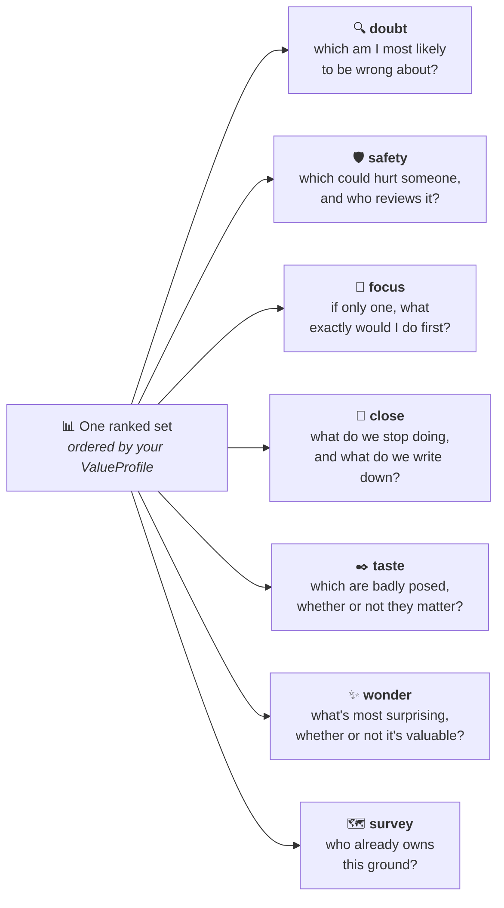
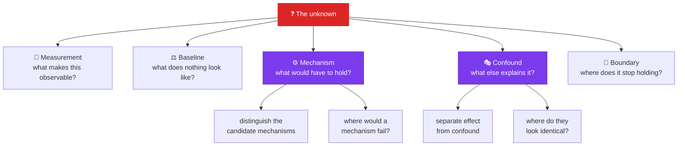
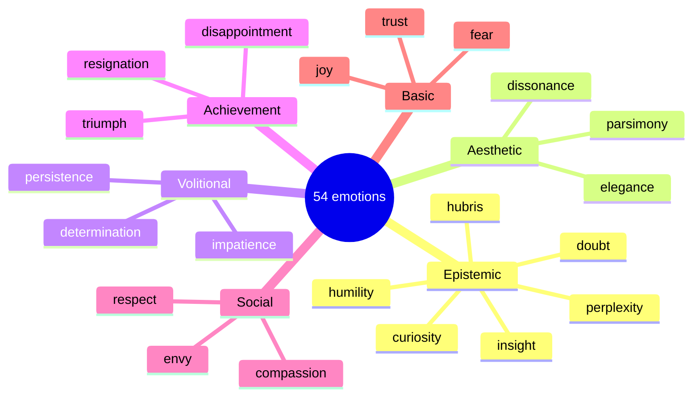
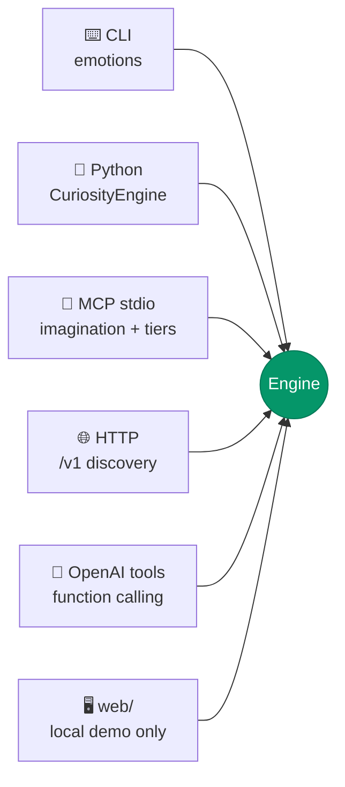

<div align="center">

# 🜂 Artificial Emotions

### **Every AI tool races to answer. This one refuses.**

*A curiosity engine that ranks what we don't yet know — then decomposes it into something you can actually go and test.*

[](https://github.com/KanakMalpani/Artificial-Emotions/actions/workflows/ci.yml)
[](tests/)
[](pyproject.toml)
[](pyproject.toml)
[](LICENSE)
[](#the-60-second-demo)

[**Quickstart**](#the-60-second-demo) · [**Discover**](#-it-generates-questions-nobody-wrote--and-can-show-the-method-works) · [**The loop**](#-the-loop-curiosity-with-causes-and-consequences) · [**Go deeper**](#-going-deeper-decompose) · [**Affect**](#-computational-affect) · [**Surfaces**](#-use-it-from-anywhere) · [**Docs**](docs/INDEX.md)

</div>

---

## The problem nobody automated

We have built extraordinary machines for answering questions.

We have built almost nothing for **choosing which question deserves the next decade of a career, a grant, or a lab.** That choice is still made by intuition, prestige, and whatever happens to be trending — and it is the highest-leverage decision in all of research.

Artificial Emotions is a **curiosity layer**. Give it a domain, a topic, and an explicit statement of what you value; get back ranked *unknowns* with gap evidence, uncertainty bands, and an investigation plan.

> [!IMPORTANT]
> **It will not answer them.** That isn't a limitation we're working around — it's the product. A tool that ranked unknowns *and* invented answers for them would quietly become the thing it was built to protect you from.

---

## The 60-second demo

```bash
git clone https://github.com/KanakMalpani/Artificial-Emotions.git
cd Artificial-Emotions
python -m venv .venv && source .venv/bin/activate   # Windows: .venv\Scripts\Activate.ps1
pip install -e ".[dev]"
```

```bash
emotions spark --domain ai --n 5 --json
```

**No API key. No network. No LLM.** Curated seeds and heuristic scoring, entirely on your machine. Here is a real result, unedited:

```jsonc
{
  "question": "Which training interventions most increase honest uncertainty
                reporting under incentive pressure to appear confident?",
  "curiosity_score": 0.8648,
  "score_band":      [0.578, 1.151],   // evidence envelope, NOT a confidence interval
  "confidence":      0.242,            // low — and it says so
  "gap_status":      "unknown_with_caveat",
  "axes": { "impact": 0.40, "neglectedness": 1.00, "tractability": 0.70,
            "surprise": 0.30, "answerability": 0.78, "risk": 0.15 },
  "flags": ["heuristic_scoring", "no_literature"],
  "epistemic_cues": ["information_gap", "curiosity_target", "confusion_risk"]
}
```

Look at what it volunteered about itself: **confidence 0.242**, flagged `heuristic_scoring`, flagged `no_literature`, gap status hedged to `unknown_with_caveat`. It tells you how much to trust it before you think to ask.

---

## 🔭 It generates questions nobody wrote — and can show the method works

Ranking a list someone typed cannot surprise you. So the engine also **generates**
candidates from literature itself, using **Swanson ABC linking**: if one body of
work ties A to B, and another ties B to C, but A and C are essentially never
studied together, then *"does A affect C via B?"* is an open question with the
bridge and the papers as evidence.

Swanson used exactly this to propose fish oil for Raynaud's (1986) and magnesium
for migraine (1988) — both from disconnected literatures, both later supported.

```bash
emotions discover "Fish oil" --corpus examples/discovery_corpus_demo.json
```

```
Fish oil  --[Blood viscosity]-->  Raynaud disease
    co-occurrence: 0 works   gap: 0.141421
    Q: Does Fish oil influence Raynaud disease, and is Blood viscosity the mechanism?
    evidence A-B: Dietary fish oil reduces blood viscosity in healthy volunteers
    evidence B-C: Blood viscosity abnormalities in Raynaud's syndrome
```

**No provider lock-in, no network required.** `DiscoveryClient` is a Protocol —
run it against a corpus you supply (reading list, BibTeX export, proceedings
dump) with zero API calls. OpenAlex is one optional backend, with caching.

### Then prove it, don't assert it

Hide everything after a cutoff year, discover from the past alone, and check
which proposals show up in the held-out future:

```bash
emotions validate --corpus examples/discovery_corpus_timesplit_demo.json \
                  --cutoff 1986 --seeds "Fish oil"
```

```
cutoff 1986: 14 past docs → 3 proposals, 2 confirmed in 6 held-out docs
             hit_rate=0.67 | baseline=0.20 | lift=3.33x

  [CONFIRMED] Fish oil --[Blood viscosity]--> Raynaud disease
  [    —    ] Fish oil --[Plasma lipids]--> Dietary fibre
  [CONFIRMED] Fish oil --[Blood viscosity]--> Vasospasm
```

> [!IMPORTANT]
> **A hit rate alone would be the vanity metric this repo forbids.** With a dense
> corpus you could "confirm" most random pairs and look brilliant. So every run
> also pairs A against randomly drawn concepts and measures how often *those*
> land. **Lift is the honest number**; lift near 1.0 means the method is doing
> nothing that shuffling would not — and there is a test asserting exactly that
> collapse happens when the future confirms everything.
>
> The random pool isn't filtered to exclude concepts the method also proposed, so
> the control can score its own hits. That makes lift a **floor, not a ceiling**.

This is one corpus at one cutoff, at small N — evidence, not a benchmark, and the
report says so. But it is a *falsifiable* claim about the method working, which
is more than this field usually offers.

---

## How it thinks


The critical edge is **Verify Gap → Score**: finding related literature does *not* mean a question is answered. Most tools collapse that distinction. This one gates on it — and an LLM gap-reader that cites a paper absent from the retrieved set gets its verdict **rejected**, not merged.

---

## 🌀 The loop: curiosity with causes and consequences

Most "AI emotion" projects hand the model a mood and print it. Here affect is
**derived from what the run actually found**, and it **changes what happens next**.

```bash
emotions explore --domain ai --steps 4
```

```
step 1  [ai]  4 new
    acted:    curiosity 0.69, hope 0.30, determination 0.25
    observed: humility 0.35, clarity 0.30, uncertainty 0.29, insight 0.26
    · n_candidates: 16 → 22
      because curiosity — Open, neglected gaps are worth casting wider for.
    · stay_the_course: False → True
      because hope — A live, reachable thread is running.
    · force_decompose: False → True
      because determination — A workable high-value target is live.
    → Determination called for the ladder rather than more breadth.

step 2  [ai]  0 new
    feels: boredom 0.93, curiosity 0.69, humility 0.35
    · diversity_threshold: 0.82 → 0.764
      because boredom — Ground already covered.
    · domain: ai → <caller picks a new one>
      because boredom — This vein is mined out; the honest move is to change ground.
    → Boredom pushed a change of ground.

step 3  [biology]  4 new
    feels: curiosity 0.71, humility 0.35, insight 0.26
```

Nothing told it to be bored. It looked at the same ground twice, found nothing
new, and **boredom is what that situation produces** — so it moved. Nothing told
it to be humble either: thin evidence met by correspondingly low confidence *is*
humility, and the system appraises itself for that before you have to.


**37 of the 54 catalogued emotions are derivable**, and 22 of those change what
the engine does. The rest are declared observation-only — surfaced for the reader,
deliberately not acted on.

| Feeling | Fires when | Changes |
|---|---|---|
| **curiosity** | Open gaps, neglected, high stakes | Widens the candidate pool |
| **confusion** | Judges disagree, or answerability is low | Narrows, forces decomposition |
| **boredom** | This ground is already mined | Suppresses duplicates, changes domain |
| **hubris** | Confidence outran the evidence | **Makes the system go get literature** |
| **anxiety** | Dual-use material in the set | **Tightens the risk ceiling, demands review** |
| **skepticism** | An LLM cited work that wasn't retrieved | Forces the soundness pass |
| **absorption / hope** | A live, reachable thread is running | Vetoes the stop, holds the ground |
| **disappointment** | Gaps closed before we got there | Records the nulls and moves |
| **triumph** | A result that holds up | Turns it into a concrete plan |
| **frustration** | Repeated effort ruled nothing out | Stops the loop and records the dead end |
| **elegance, respect, envy** | Aesthetic pull, prior work, competition | **Nothing** — real drivers *and* known biases, so they are shown, not obeyed |

Runs print `acted:` and `observed:` separately, so you can see which feelings
actually moved something:

```
step 1  [ai]  4 new
    acted:    curiosity 0.69, hope 0.30, determination 0.25
    observed: humility 0.35, clarity 0.30, uncertainty 0.29, insight 0.26
    · stay_the_course: False → True
      because hope — A live, reachable thread is running.
```

> [!NOTE]
> **Affect is allowed to make a safety gate stricter, never looser.** `anxiety`
> lowers `max_risk`; nothing raises it. And `tests/test_appraisal_coverage.py`
> asserts every rule is firable and that each one either changes behaviour or is
> explicitly declared observation-only — the catalog cannot quietly rot back into
> decoration.

> [!IMPORTANT]
> **Affect moves search behaviour — never your scoring weights.**
> Ranking stays a pure function of the `ValueProfile` you stated. Weight
> modulation exists but is opt-in (`--affect-weights`), capped at ±0.08, and
> every delta is listed in the output. Otherwise this tool would be smuggling
> hidden values into the one thing built to refuse them.
>
> Every signal ships with its evidence. Affect you cannot audit is affect you
> cannot trust.

---

## Three things it does

<table>
<tr>
<td width="33%" valign="top">

### 🎯 Rank

Turns a field into an ordered list of **unknowns**, scored on six axes under a value profile you choose.

Never value-free. There is no neutral mode, because there is no neutral ranking.

</td>
<td width="33%" valign="top">

### 🔬 Decompose

Takes one unknown and asks the **next** layer of questions — measurement, mechanism, confound, boundary.

Then names the single observation worth making first.

</td>
<td width="33%" valign="top">

### 🜂 Feel

Affect **derived from** what a run found, that **changes** what it does next — with optional CLI continuity, disclosed costs/scars, and quarantined imagination.

54 emotions, 6 families, seven stances, and stance-twin lenses — still annotation only; never a claim that it feels.

</td>
</tr>
</table>

---

## 🧭 Curiosity is not the only useful feeling

Curiosity asks **"what is worth investigating?"** — and for a long time that was the only question this repo could ask. Every other emotion was a modifier on how curiosity searched.

But researchers don't only feel curious. Before committing a quarter to something they feel **doubt**. Before touching a risky area, **anxiety**. Looking at a pile of half-finished threads, **resignation** — and the good ones act on it.

**Stances** make those the point instead of the side-effect. Same ranked set, seven different questions:



```bash
emotions stance doubt --domain ai --n 5
```

```
[doubt]  Which of these am I most likely to be wrong about?
driven by: skepticism, suspicion, hubris, humility

  · What measurable internal signals most reliably predict goal-misgeneralization…
      doubt_score: 0.84
      - scored heuristically — no judge looked at it
      - no literature was consulted, so the gap is unverified
      - confidence is low (0.24)
      - score band is wide (0.57) — weakly pinned
      - gap status is hedged, not established
      - no related work was found to argue against

Not claimed: a re-ranking — the ValueProfile ordering you were given is unchanged.
```

A stance is **a view, never a verdict**. It cannot rescore anything, and every payload says so. `wonder` is the sharpest example: it deliberately ignores your ValueProfile and ranks on surprise alone, then reports where it *disagrees* with your values — because a profile that never surprises you is a profile that is filtering something out.

```bash
emotions stance list          # what each one asks, and when to reach for it
emotions stance safety --domain medicine
curl "localhost:8000/v1/stances/close?domain=ai"
```

**This is what stops the catalog from being decoration.** A test in `tests/test_appraisal_coverage.py` asserts that *every* appraisable emotion either steers the search or drives a stance — 37 of 37, no exceptions, enforced in CI. Being named and disclaimed is not a use.

---

## 🕰️ Continuity — and imagination under quarantine

Affect that dies when the process exits cannot surprise you twice. **Alive**
adds continuity and generative lenses without claiming phenomenal feeling.

### Memory defaults (privacy-first)

| Surface | Persistent memory |
|---|---|
| CLI `emotions explore` | **On** — local JSON at `~/.artificial_emotions/memory.json` |
| Library `explore(...)` | **Off** (`persist_memory=False`) |
| MCP / HTTP | **Off** by default |

Opt out everywhere with `CURIOSITY_NO_MEMORY=1` (or `explore --no-memory`).
Inspect, edit, or wipe: `emotions memory show|forget|reset`.

**Scars, costs, temperament, and avoidance** bias search from that history —
disclosed, capped **behavioral biases**, not motives. Avoidance reports
questions seen often and never picked (`pattern_not_motive`); it cannot tell
avoidance from judgment. `emotions dream` is **explicit offline reanalysis** of
the same file — never a background loop, never labeled as dream-evidence.

### Imagination — sealed, then optional

```bash
emotions imagine list
emotions imagine premortem --domain ai --n 5
emotions imagine transfer --seed "Fish oil" --corpus examples/discovery_corpus_timesplit_demo.json
```

Imagined material travels only under the `imagined` key with
`honesty: "imagined_not_retrieved"` and never shares a list with ranked
unknowns. **Wired today:** `premortem`, `reformulation`, `counterfactual`.
**Registered stubs** (generators next): `harm_scenario`, `rehearsal`, `eulogy`.
**Transfer** is corpus-gated on purpose (not `apply_imagination` over a ranking)
and cleared the same validate lift bar as discovery — **≈5×** over random
pairing on the bundled timesplit corpus; a dense-corpus control collapses lift
to chance.

---

## 🔬 Going deeper: `decompose`

Ranking tells you *what* to investigate. This takes one unknown **a step further toward a solution** — without becoming an answer engine.

```bash
emotions decompose \
  "Which evaluation protocols most reduce sandbagging when models detect testing?" \
  --ops "Capability gap <= 5% versus hidden probes." --depth 2
```



Alongside the tree you get three things that turn a question into a plan:

| Output | What it gives you |
|---|---|
| **The first observation** | Chosen from your stated criteria *and* the score axes. No usable measurement? Start there. Shaky question? Probe its boundary. Well-posed? Go kill the rival explanations. |
| **Falsifiers** | Derived from your own operationalization. `Capability gap <= 5%` becomes **refuted if `Capability gap > 5%`**. |
| **Stop rules** | Including a review gate that fires automatically when the risk axis is elevated. |

> [!NOTE]
> **Every string it emits is a question, a test, or a criterion — enforced, not intended.**
> `assert_free()` scans the whole payload for assertion language, and results ship with `assertion_free: true`. A decomposition that concluded something would be a *bug*. There's also a test that the checker itself still catches assertions, so the guarantee can't quietly go hollow.
>
> Even a complete decomposition signs off by telling you the original gap is **not** thereby closed.

---

## 🜂 Computational affect

Not decoration. The catalog is a **vocabulary for investigative states** — and it names the ones that actually govern research decisions.



**`humility` and `hubris` are both in there on purpose.** This project exists to keep confidence proportionate to evidence. The failure mode needs a name as much as the discipline does.

### Mixing past pairs

Most affect models stop at two-component blends. This returns three structural readings:

| Field | What it reports |
|---|---|
| `plutchik_dyad_hint` | Named 2-component compound — `joy + trust → love` |
| `blend_triad_hint` | Named 3-component blend — `curiosity + skepticism + humility → disciplined_inquiry` |
| **`ambivalence`** | **Opposing entries held at once**, scored across 13 opposition axes |

Ambivalence is the one that matters. Hold conviction beside live doubt and the simulation doesn't average them into mush — it reports the tension and tells you what to do with it:

```bash
emotions mix conviction=45 doubt=40 urgency=15 --json
```

```jsonc
{
  "ambivalence": {
    "score": 0.756,
    "pairs": [{ "components": ["conviction", "doubt"], "axis": "epistemic" }]
  },
  "pad": { "P": 0.113, "A": 0.510, "D": 0.305 },
  "felt_simulation": {
    "intensity": 0.483,
    "inner_monologue":
      "Simulated affect: I register primarily conviction, blended with Doubt (40%)
       and Urgency (15%) — mood reads ambivalent, mid-arousal, empowered.
       I am pulled two ways — conviction against doubt. Do not resolve that by
       picking a side: name the observation that would settle it."
  }
}
```

Sustained ambivalence is reported as an **honest state**, not an error to resolve.

> [!WARNING]
> **This is `computational_affect`, and every payload says so.**
> Not biological feeling. Not consciousness. Not biometric emotion recognition, and not measurement of anyone's affect — which matters under the EU AI Act. It is a PAD blend simulating a stance for framing. Nothing more, and it never claims more.

---

## 🔌 Use it from anywhere



<details>
<summary><b>⌨️ CLI</b> — shell workflows and quick inspection</summary>

<br/>

```bash
emotions discover "Fish oil" --corpus corpus.json                 # generate new questions
emotions validate --corpus corpus.json --cutoff 1986 --seeds "Fish oil"   # prove the method
emotions explore --domain ai --steps 5                           # the curiosity loop
emotions spark --domain biology --profile alignment_lab --json   # fast offline pack
emotions run --domain ai --n 5 --no-literature --json            # full pipeline
emotions decompose "Which mechanism explains X?" --depth 2       # go deeper
emotions imagine premortem --domain ai                           # quarantined imagination
emotions memory show                                             # local CLI continuity
emotions dream                                                   # explicit history reanalysis
emotions compare-profiles --a humanity_default --b alignment_lab # whose values?
emotions mix curiosity=40 confusion=30 awe=30 --json             # affect
emotions profiles                                                # list presets
```

Domains: `ai` · `biology` · `physics` · `climate` · `medicine` · `materials` · `social` · `energy` · `general`

*(`curiosity` and `curiosity-mcp` still work as pre-rename aliases.)*

</details>

<details>
<summary><b>🐍 Python</b> — libraries and notebooks</summary>

<br/>

```python
from artificial_emotions import CuriosityConfig, CuriosityEngine, provoke
from artificial_emotions.decompose import decompose_ranked
from artificial_emotions.emotions import mix_emotions
from artificial_emotions.explore import explore

pack = provoke(domain="ai", n=5, fast=True, profile_name="alignment_lab")
print(pack["inject"])                      # paste into any model's context

results = CuriosityEngine(
    CuriosityConfig(domain="climate", n_return=5, use_literature=False)
).run()

plan = decompose_ranked(results[0], depth=2)
assert plan["assertion_free"] is True      # it never answered anything

mood = mix_emotions({"curiosity": 60, "doubt": 40})
print(mood["felt_simulation"]["inner_monologue"])

trail = explore(domain="ai", steps=5)      # curiosity with a history
for step in trail["trajectory"]["steps"]:
    print(step["step"], step["primary_feeling"], "→", step["note"])
```

</details>

<details>
<summary><b>🔗 MCP</b> — Cursor, Claude Desktop, Claude Code, Copilot, Continue, Windsurf</summary>

<br/>

```bash
emotions-mcp        # or: python -m artificial_emotions.mcp_server
```

```json
{
  "mcpServers": {
    "artificial-emotions": {
      "command": "/path/to/Artificial-Emotions/.venv/bin/python",
      "args": ["-m", "artificial_emotions.mcp_server"]
    }
  }
}
```

Tools include ranking, stances, and **imagination** (`list_imagination_kinds`,
`apply_imagination`). Memory / dream / transfer tools are being exposed on the
same registry in parallel — treat
[`agent_tools_pkg/registry.py`](src/artificial_emotions/agent_tools_pkg/registry.py)
as the source of truth rather than a frozen count here. Set
`CURIOSITY_MCP_TIER=core|investigate|affect|research` to shrink the surface.
Host-by-host setup in [docs/PLUGINS.md](docs/PLUGINS.md). Persistence stays
**off** on MCP by default.

</details>

<details>
<summary><b>🌐 HTTP + OpenAI tools</b> — agent backends and function calling</summary>

<br/>

```bash
emotions serve      # 127.0.0.1:8000 — interactive docs at /docs
```

| Route | Purpose |
|---|---|
| `GET\|POST /v1/curiosity/provoke` | Fast investigation pack |
| `POST /v1/curiosity/run` | Full ranking pipeline |
| `POST /v1/curiosity/decompose` | Sub-questions, first step, falsifiers |
| `POST /v1/curiosity/explore` | The full loop: appraise → feel → modulate → remember |
| `GET /v1/stances`, `/v1/stances/{stance}` | Non-curiosity views over a ranking |
| `POST /v1/emotions/mix` | Affect blend + felt simulation |
| `GET /v1/agent` | Machine-readable capability **and honesty** guide |
| `GET /v1/agent/tools` | OpenAI-compatible function schemas |
| `GET /health`, `/ready` | Liveness, config summary, offline readiness |

Imagination / memory / dream / transfer HTTP routes mirror the CLI and land via
`/v1` discovery as they ship — check `GET /v1/agent` rather than assuming a
fixed path list. Auth is opt-in: set `CURIOSITY_API_KEY` and every route outside
the open list requires a bearer token. Unset, it stays open for local demos.

</details>

<details>
<summary><b>🖥️ web/</b> — mood-reactive local demo (not a product)</summary>

<br/>

```bash
cd web && npm install && npm run dev   # http://localhost:5173
```

Affect-derived CSS tokens, stance lenses, and imagination/memory panels for
**local evidence** of the mood shell. No deploy story, no auth, no multi-user,
no server-side memory. Product scope for `web/` is frozen at demo quality —
see [docs/PLAN_ALIVE.md](docs/PLAN_ALIVE.md).
A short local demo recording (GIF or similar) of the mood shell
is recommended for a future README media slot.

</details>

---

## How the ranking works

```
                (Impact^α · Neglectedness^β · Tractability^γ · Surprise^δ) · Answerability · (1 − Risk)
curiosity  =  ─────────────────────────────────────────────────────────────────────────────────────────
                                              cost + ε
```

A **geometric** mean, deliberately. It preserves weak-link behaviour: a near-zero tractability collapses the whole score instead of being averaged away by a flattering impact number.

| Axis | Asks | Guardrail |
|---|---|---|
| **Impact** | What changes if this is answered? | Stake language only — citation counts *never* inflate it |
| **Neglectedness** | Is anyone already on this? | Literature density and answer pressure push it down |
| **Tractability** | Could we make progress now? | — |
| **Surprise** | Would the answer shift beliefs? | Not EVSI, and never claimed to be |
| **Answerability** | Is it posed sharply enough? | Multi-clause research programmes get penalised |
| **Risk** | Dual-use / harm proxy | Heuristic filter, **not** a biosecurity authority |

The exponents come from your `ValueProfile` — one of 7 presets, or your own. **There is no value-free ranking**, and the tool refuses to pretend otherwise.

---

## Why you can trust the numbers

This is the part most tools skip. Here it's load-bearing — and enforced in code rather than promised in prose.

<table>
<tr><td width="50%" valign="top">

**🚫 Hallucinated citations are rejected**
An LLM gap-reader citing a paper absent from the retrieved set has its verdict thrown out and the heuristic gap kept — annotated with *why*.

**🚫 No vanity accuracy metric**
`evals/METHODOLOGY.md` forbids publishing a single accuracy %. The harness reports results stratified by gold status instead.

**🚫 Tool descriptions are linted**
`mcp_lint.py` checks the project's own tool copy for manipulation and missing honesty tokens. It has failed our own commits.

</td><td width="50%" valign="top">

**🚫 No silent consensus**
`compare-profiles` shows two value systems side by side with Kendall τ. It structurally cannot merge them into a fake agreement score.

**🚫 Reproducible by construction**
Identical input yields byte-identical JSON — verified across three `PYTHONHASHSEED` values in separate processes.

**🚫 Decomposition cannot conclude**
`assert_free()` scans for assertion language — and a second test proves the checker still catches one.

</td></tr>
</table>

Scores are **decision aids, not oracles**. The `[low–high]` band is an evidence-strength envelope, not a statistical confidence interval. A literature neighborhood is evidence to inspect, not proof of anything. Read [docs/LIMITS.md](docs/LIMITS.md) before treating any rank as truth.

---

## Verify it yourself

```bash
pip install -e ".[dev]"
pytest -q --cov --cov-report=term-missing     # ~680 tests · 88% · floor enforced
ruff check src tests && ruff format --check src tests
```

CI runs lint, tests, and the coverage gate on **Python 3.11, 3.12 and 3.13** — then builds the wheel, installs it into a clean environment, and exercises the data files and console scripts from *outside* the checkout. A package that only works inside its own source tree is a broken package.

**Not on PyPI yet** — install from a git clone (`pip install -e ".[dev]"`).

---

## Documentation

| | |
|---|---|
| [**docs/INDEX.md**](docs/INDEX.md) | Everything, organised |
| [**docs/ARCHITECTURE.md**](docs/ARCHITECTURE.md) | Module map, Alive continuity/imagination, trust boundaries |
| [**docs/LIMITS.md**](docs/LIMITS.md) | Verified capabilities and honest bounds |
| [**docs/EMOTIONS.md**](docs/EMOTIONS.md) | Catalog, mixing, affect safety |
| [**docs/PLAN_ALIVE.md**](docs/PLAN_ALIVE.md) | Continuity + imagination; `web/` demo freeze |
| [**docs/PLUGINS.md**](docs/PLUGINS.md) | Host-by-host MCP setup |
| [**docs/PROOFS.md**](docs/PROOFS.md) | Reproducible behaviour demos |
| [**CHANGELOG.md**](CHANGELOG.md) | `[0.4.0]` Alive notes (PyPI deferred) |
| [**examples/**](examples/README.md) | Payloads, protocols, tool schemas |

---

## Contributing

Domain packs, seed questions, eval fixtures, and honesty patches are all welcome — start with [CONTRIBUTING.md](CONTRIBUTING.md). Changes to ranking, gap logic, tools, or public claims should ship with tests and updates to the relevant limits docs.

One rule above the rest: **don't add a claim the code can't back.** If a feature needs a caveat, the caveat ships inside the response payload — not in a footnote nobody reads.

**Security.** Keep credentials in local env files; never commit `.env`, keys, or tokens. Before exposing HTTP beyond localhost set `CURIOSITY_API_KEY`, and don't bind `0.0.0.0` without auth. Report vulnerabilities privately to the maintainer rather than in a public issue.

---

<div align="center">

**MIT licensed** · [LICENSE](LICENSE)

### *The best question is worth more than a fast answer.*

</div>
