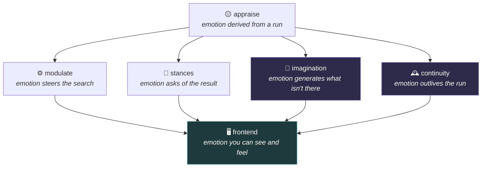
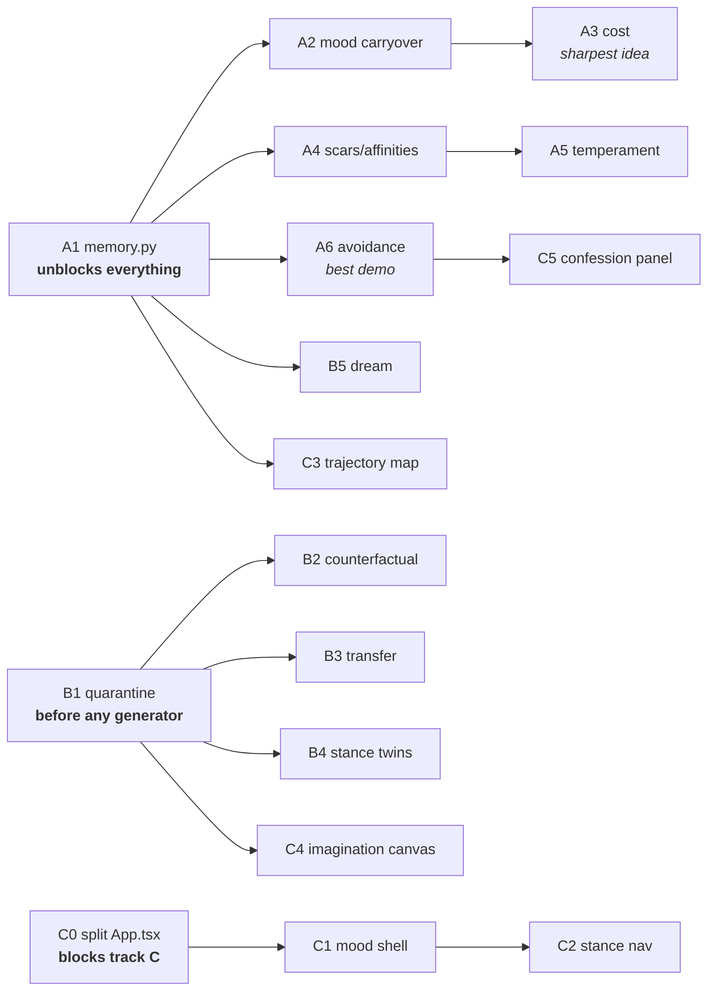

# Plan: frontend, imagination, and feeling alive

**Status:** Alive core shipped on `main` (continuity + imagination).
Written 2026-07-30; status updated with the 0.4.0 Alive line.
**Frontend / Track C:** `web/` was **removed** from the tree (historical plan only —
do not treat Track C below as active work). Continuity visual proof is
`docs/media/avoidance.svg`, not a mood-shell SPA.
**Scope (original):** three tracks — a frontend that behaves emotionally, an
imagination layer, and continuity that makes the system feel like a someone
rather than a function call.

Read §0 first. It contains a decision only you can make, and every other section changes depending on how you make it.

---

## 0. The tension you have to resolve first

This repo's single most valuable asset is that **it does not lie about itself**. That is enforced, not aspirational:

| Where | What it enforces |
|---|---|
| `src/artificial_emotions/mcp_lint.py` | `FORBIDDEN_PHRASES` literally bans `"feels curiosity"`, `"the ai is curious"`, `"detects emotions"`, `"emotion recognition"` |
| same file, `_EMOTION` tokens | every affect tool description **must** contain `"does not feel"` / `"annotation only"` / `"computational affect"` |
| `tests/test_mcp_description_lint.py` | CI-red if either rule is violated |
| `affect.py` → `felt_simulation` | ships `not_claimed` on every payload |
| `docs/EMOTIONS.md` | a whole section titled *Anti-anthropomorphism* |

"I want it to feel like a real human" runs directly into that. If you implement it naively you will spend a day deleting your own guards, and what you'll have built is the thing this repo was explicitly designed not to be — and the thing a thousand other repos already are.

**But the request is right.** The problem is the word, not the goal. There are two very different things "feel human" can mean:

| | Phenomenal claim | Functional humanness |
|---|---|---|
| Says | "the system *experiences* curiosity" | "the system has states it did not choose, that persist, that cost it something" |
| Provable | No. Not by you, not by anyone | Yes. Every property is observable and testable |
| Guards | Requires deleting them | Requires *more* of them |
| Distinctive | No — everyone claims this | Yes — almost nobody builds this |
| Impressive | Only to people who don't look closely | More impressive the closer you look |

**Recommendation: build the second, and keep every guard.** Not as a compromise — because it is the stronger product. A system that says "I feel curious" is making a claim you can't back. A system that says *"I've circled this question four times without picking it up, and I notice I keep finding reasons not to"* — and can show you the four timestamps — is doing something no other tool does, and every word of it is true.

### What actually makes something feel alive

Not the vocabulary. Four structural properties, none of which this repo has yet:

1. **Continuity** — it remembers being itself yesterday. Today's mood has causes in last week.
2. **Involuntariness** — states it cannot choose, suppress, or talk itself out of.
3. **Cost** — feelings that make it *worse* at things, not just better-directed. This is the big one. Every emotion in the repo today is, functionally, an optimization heuristic wearing a name. Real affect has a downside.
4. **Idiosyncrasy** — *this* instance differs from a fresh one because of what happened to it.

The whole of Track A is those four. That is the "feels human" track, and it doesn't require a single dishonest sentence.

**Decide now, because it forks the plan:**
- **(a) Functional humanness, guards intact** — the plan below, as written.
- **(b) Phenomenal framing** — then §A6, the lint rules, `docs/EMOTIONS.md`, `LIMITS.md`, and every `claims_not` payload need rewriting first, and you should know you're trading the repo's differentiator for a more familiar one.

Everything below assumes **(a)**.

---

## 1. What exists today

Grounded inventory, so the plan builds on facts rather than memory.

| Piece | File | Lines | State |
|---|---|---:|---|
| Appraisal (37 rules) | `appraisal.py` | 575 | Solid. Emotion derived *from* a run, with evidence. |
| Modulation (22 acting) | `modulate.py` | — | Solid. Bounded, logged, capped. |
| Stances (7) | `stances.py` | 482 | New. Views over a ranking, never re-rank. |
| The loop | `explore.py` | 251 | Solid. rank → appraise → feel → modulate → remember. |
| Session memory | `trajectory.py` | 179 | **Session-only. Nothing survives the process.** |
| Felt simulation | `affect.py` | 249 | PAD mood, `inner_monologue`, `embodiment_hint`, `not_claimed`. |
| Discovery | `discover.py` | — | Swanson ABC. The closest thing to imagination that exists. |
| Honest measurement | `validate.py` | — | Time-split, random baseline, lift. **Reuse this.** |
| Web UI | `web/src/App.tsx` | **1078** | One file. React 19 + Vite 6. No router, no state lib, no tests, no design tokens. |

Three facts that drive everything below:

- **`trajectory.py:175` says it out loud:** *"Session memory only — nothing persists between processes."* That single limitation is why the system cannot feel like a someone. It wakes up new every time. Fixing it is the highest-leverage change in this entire document.
- **There is no imagination module.** `discover.py` generates questions nobody wrote, but only by recombining a corpus. Nothing counterfactual, nothing analogical, nothing hypothetical.
- **`App.tsx` is 1078 lines**, which breaks your own 800-line rule. Track C can't start on top of it.

---

## 2. The organizing idea

Today emotion can do exactly two things: steer a search (`modulate`) or ask a question of a result (`stances`). Both are **reactive** — something must already exist for the emotion to act on.

The three tracks add the missing modes:



| Mode | Direction | Track |
|---|---|---|
| `modulate` | reactive, inward | exists |
| `stances` | reactive, outward | exists |
| **`imagination`** | **generative** | **B** |
| **`continuity`** | **temporal** | **A** |
| **frontend** | **expressive** | **C** |

Build order is **A → B → C**, and the reason is not preference. Imagination without continuity is a random idea generator. A frontend without either is a dashboard. Continuity is the substrate; it makes the other two mean something.

---

## Track A — Continuity: the thing that actually reads as alive

**Goal:** the system stops waking up new. It has a yesterday, states it can't choose, feelings that cost it something, and a history that makes this copy different from a fresh install.

This is the highest-value track and the cheapest. Budget ~40% of total effort.

### A1. Persistent trajectory — `memory.py`

The unlock. Everything else in Track A depends on it.

**Build:** `src/artificial_emotions/memory.py`

```python
@dataclass
class PersistentMemory:
    """What survives the process. Deliberately small and inspectable."""
    path: Path                          # default ~/.artificial_emotions/memory.json
    sessions: list[SessionRecord]       # capped, oldest evicted
    mood_carryover: MoodState           # PAD + decay timestamp
    scars: list[Scar]                   # domains/questions that went badly
    affinities: list[Affinity]          # domains/questions that went well
    encounters: dict[str, int]          # question_id -> times seen, ever
```

- JSON on disk, human-readable, hand-editable. **No database.** A user must be able to `cat` it and see exactly what the system remembers about them.
- Cap it (~200 sessions). Eviction is itself a feature — see A4.
- `emotions memory show` / `emotions memory forget <what>` / `emotions memory reset`. Forgetting must be *easy* and *complete*.

**Guards:**
- `test_a_second_process_remembers_the_first`
- `test_memory_file_is_human_readable_and_hand_editable`
- `test_forget_actually_forgets` — reload from disk, assert gone
- `test_memory_is_capped_and_evicts_oldest`

**Honesty:** this is a file on the user's disk recording their usage. Say so, loudly, in `LIMITS.md` and on first write. Opt-out via `CURIOSITY_NO_MEMORY=1`. Never on by default in the MCP/HTTP server surfaces — only the CLI, where there's a single obvious user.

### A2. Mood carryover and decay

Right now every run starts from emotional zero. Humans don't.

**Build:** in `affect.py` / `memory.py`
- Session-end mood is written to `mood_carryover` with a timestamp.
- Next session opens by loading it and applying **exponential decay** against wall-clock time — a half-life of a few hours. Come back in five minutes and yesterday's frustration is still there. Come back next week and it's gone.
- The starting mood is a *bias on appraisal*, not an override. It shifts thresholds; it never invents evidence.

**Why this reads as human:** the first thing that makes a system feel like a someone is meeting it in a mood it didn't choose and can't explain by anything in the current session.

**Guards:**
- `test_mood_persists_across_processes`
- `test_mood_decays_toward_neutral_with_elapsed_time`
- `test_carryover_biases_thresholds_but_never_fabricates_evidence` — the critical one. Carryover must not make an emotion fire that has no support in the run.

### A3. Cost — the section that matters most

**Every emotion in the repo today makes it better at something.** `anxiety` tightens safety. `skepticism` fetches literature. `absorption` protects a thread. That is not affect. That is a well-named optimizer.

Real feelings have a downside, and a system whose feelings only ever help is transparently fake. This is the single sharpest thing you can build.

**Build:** `costs.py`, or extend `modulate.py`
- **Distraction:** high `wonder`/`surprise` can pull the loop onto a shiny, *lower-scoring* branch — and the trajectory records that it did.
- **Avoidance:** `reluctance`/`anxiety` above threshold can make it skip a question it should have taken. Logged as a skip, not silently dropped.
- **Tunnel vision:** high `absorption` suppresses breadth past the point of usefulness — it keeps going when it should have stopped.
- **Sourness:** accumulated `frustration` desaturates scoring in a domain, biasing it against ground where it previously failed.
- **Fatigue:** long sessions degrade — shorter candidate pools, earlier stops.

**Non-negotiable constraint:** cost may **never** loosen a safety gate. `anxiety` still lowers `max_risk` and nothing raises it. Costs apply to breadth, persistence, attention and mood — never to risk ceilings, never to the honesty payloads. Write this as an invariant test before writing the feature.

**Guards:**
- `test_an_emotion_can_make_the_run_worse` — construct a state where affect measurably lowers the final best score, then assert it. If you can't write this test, you haven't built affect.
- `test_cost_never_loosens_a_safety_gate` — mutation-test it.
- `test_every_cost_is_disclosed_in_the_trajectory` — it must always be visible that a feeling cost something.

**Surface:** `emotions explore` should be able to end with *"I spent three steps on something that scored lower than what I'd already found, because it surprised me."* That sentence is the product.

### A4. Scars and affinities — idiosyncrasy

**Build:**
- A **scar**: a domain/question where runs repeatedly went nowhere. Raises the bar for returning. Decays slowly. `emotions memory show` lists them in plain language.
- An **affinity**: ground that repeatedly paid off. Slight pull back toward it.
- Both are *biases with stated magnitude*, capped like `MAX_WEIGHT_DELTA`, and always listed in the run payload.

**Why:** this is what makes *your* copy different from a fresh install. Two people running the same command on the same domain get different behaviour, and the system can explain exactly why.

**Guards:**
- `test_two_instances_with_different_histories_diverge`
- `test_a_scar_decays_and_eventually_stops_mattering`
- `test_scar_influence_is_bounded_and_always_disclosed`
- `test_a_fresh_install_behaves_identically_to_today` — a memory-less run must be byte-identical to current behaviour. This keeps determinism testable and keeps memory opt-out honest.

### A5. Temperament — a `.toml` personality

**Build:** `temperament.py` + `~/.artificial_emotions/temperament.toml`

```toml
[temperament]
baseline_mood      = { valence = 0.1, arousal = -0.1, dominance = 0.0 }
reactivity         = 0.7   # how hard appraisal swings
recovery_rate      = 0.4   # how fast mood returns to baseline
skepticism_bias    = 0.3
novelty_seeking    = 0.8
risk_aversion      = 0.5
```

Three or four named presets (`restless`, `cautious`, `dogged`, `flighty`) plus custom. Same run, same corpus, visibly different behaviour and different mood trace.

**Guard:** `test_presets_produce_measurably_different_trajectories` — assert on the actual trajectories, not just that the config loaded.

### A6. Avoidance detection — the highest-impact single feature in this document

You already store everything needed for this. `trajectory.py` tracks `seen_question_ids`, `dead_ends`, and `surprises`. Persist that (A1) and one genuinely striking capability falls out:

**The system notices what it is avoiding.**

```
I've now seen ai-04 in six sessions and picked it up zero times.
Each time something scored marginally higher. That pattern is
either good judgment or avoidance, and I can't tell which from here.
```

Every word of that is true, checkable, derived from stored data, and no other tool says it. It is *the* demo. It's also cheap — it's a query over A1 plus a threshold.

**Build:** `avoidance.py` — encounters vs. selections per question id, flag persistent non-selection, surface in the final feeling and as `emotions memory avoiding`.

**Guards:**
- `test_avoidance_requires_real_repeated_encounters` — no crying wolf on one sighting
- `test_avoidance_is_not_claimed_as_a_motive` — it reports the pattern and explicitly says it cannot distinguish avoidance from judgment. **Do not let this feature start mind-reading.**

### Track A acceptance

Track A is done when: a user runs `emotions explore` on Monday, comes back Wednesday, and the system's opening mood, choice of ground, and closing monologue are all visibly shaped by Monday — and every one of those influences can be traced to a line in a readable JSON file they can delete.

---

## Track B — Imagination

**Goal:** generate what isn't in the corpus. Today the system can only rank, decompose, and recombine what exists.

Budget ~35%. Depends on A only lightly (imagination is better with mood, but works without).

### B0. The architectural insight

Each stance already has a natural generative twin. Stances *read* what exists; imagination *generates* what doesn't. Same emotional driver, opposite direction:

| Stance (reads) | Imaginative twin (generates) | Driver |
|---|---|---|
| `doubt` — which am I wrong about? | **premortem** — imagine this failed; what killed it? | skepticism, suspicion |
| `safety` — which could hurt someone? | **harm scenario** — imagine the misuse concretely | anxiety, compassion |
| `focus` — what do I do first? | **rehearsal** — imagine running the experiment; what breaks? | determination, absorption |
| `close` — what do we stop? | **eulogy** — imagine we abandoned it; what was lost? | resignation, disappointment |
| `taste` — which are badly posed? | **reformulation** — imagine a better version of this question | elegance, parsimony, clarity |
| `wonder` — what's most surprising? | **counterfactual** — imagine the answer is X; what else must be true? | wonder, surprise, insight |
| `survey` — who owns this ground? | **transfer** — imagine this mechanism in another field | respect, envy, recognition |

That symmetry is worth building for on its own — it gives `imagine.py` the same shape as `stances.py`, which your team (and your guards) already understand.

### B1. The quarantine — build this before any generator

Imagination *asserts*. Every other module in this repo is forbidden from asserting; `decompose.py` has `assert_free()` to enforce it. Imagination is the one place assertion is allowed — which makes it the one place that can poison the repo's credibility.

**So build the container before the contents.**

**Build:** `imagine.py`
```python
@dataclass(frozen=True)
class ImaginedContent:
    content: str
    kind: str                 # counterfactual | premortem | transfer | ...
    driven_by: tuple[str,...]
    grounded_in: list[str]    # ids/titles that actually exist
    invented: list[str]       # what was made up — stated, not hidden
    status: str = "imagined"  # never anything else
    confidence: None = None   # imagination does not get a score
```

Rules, enforced by tests:
- Imagined content is **never** returned in the same list as ranked questions. Different payload key, different CLI section, different colour in the UI.
- Every payload carries `honesty: "imagined_not_retrieved"`.
- `confidence` is structurally `None` — do not let a number appear next to a fantasy.
- **Imagination cannot feed ranking.** An imagined link may become a *candidate question* only after passing the same gap-verification every other candidate passes. There is a one-way valve, and it is tested.

**Guards:**
- `test_imagined_content_never_appears_unmarked`
- `test_imagination_cannot_reach_the_ranking_without_verification` — mutation-test this one hard
- `test_imagined_payloads_carry_no_confidence_score`

### B2. Counterfactual imagination — `imagine counterfactual`

*"Suppose the answer to this unknown is X. What else would have to be true?"*

Take a ranked question, posit each plausible answer, forward-derive consequences, then check which consequences are **already checkable against existing literature**. That last step is what makes it useful rather than creative writing: it converts a fantasy into a cheap test.

Reuse `decompose.py`'s falsifier machinery — it already derives what would have to hold.

**Output:** for each posited answer — implied consequences, which are already contradicted by known work, and the cheapest one to check.

**Guard:** `test_counterfactual_flags_consequences_that_existing_literature_contradicts` on the bundled corpus.

### B3. Analogical transfer — `imagine transfer`

The most likely to produce something genuinely novel, and the most likely to produce slop. It needs the strongest measurement.

*"This mechanism works in domain A. Does the same structure appear in domain C?"*

This generalizes Swanson ABC from **term co-occurrence** to **structural analogy** — and you already have the ABC plumbing in `discover.py` and the honest-measurement harness in `validate.py`.

**Critical:** hold it to the same bar as discovery. `validate.py` already does time-split validation with a random-pairing baseline and lift. **Run analogical transfer through that exact harness.** If transferred analogies don't beat random pairing on held-out future literature, the feature does not ship. You already built the machine that can tell you the truth here; use it.

**Guards:**
- `test_transfer_beats_random_pairing_on_the_timesplit_corpus`
- `test_transfer_lift_collapses_to_chance_on_a_dense_corpus` — same anti-vanity check `validate.py` already uses

### B4. Stance-twin generators

Implement the table in B0 as `imagine.py` lenses mirroring `stances.py`. Same `Stance`-like dataclass shape, same registry pattern, same CLI/MCP/HTTP wiring. Cheap to build once B1 exists, and it gives all seven emotional clusters a *generative* job on top of their interpretive one.

Start with **premortem** and **reformulation** — both are immediately, obviously useful and neither requires network.

### B5. Dreaming — optional, do last, high demo value

**Idle consolidation.** With A1 in place: on an explicit command (`emotions dream`, never automatic, never background), the system re-reads its own stored history and looks for structure it missed live — recurring dead ends, a term appearing across unconnected sessions, a scar that no longer matches evidence.

Honest framing: this is **offline reanalysis of stored history**, and it should say exactly that. Do not call the output a dream in the payload. Call it that in the CLI, once, and let the user enjoy it.

**Guard:** `test_dream_only_reads_stored_history_and_invents_no_new_literature`

### Track B acceptance

Track B is done when analogical transfer clears the `validate.py` lift bar on held-out data, and when a mutation that lets imagined content reach the ranking makes CI red.

---

## Track C — Frontend

> **HISTORICAL / REMOVED (2026-08):** The `web/` SPA and mood-shell
> demo surface were deleted. Leave this track as written history; do not resume it.

**Goal:** an interface where emotion is *the interaction model*, not a readout. Budget ~25%, and none of it starts until C0 is done.

### C0. Pay the debt first

`web/src/App.tsx` is **1078 lines** — over your own 800 limit, with no router, no state management, no design tokens, and no tests. Nothing in this track should be built on it.

- Split by surface: `features/rank/`, `features/explore/`, `features/stances/`, `features/imagine/`, `features/memory/`.
- Add design tokens (`styles/tokens.css`) — you will need them immediately in C1.
- Add Playwright + visual regression at 320/768/1024/1440. Per your web testing rules, visual regression carries more signal than markup assertions for this kind of UI.
- Decide state: server state via TanStack Query, affect state via Zustand. Do not hand-roll it.

This is a day of unglamorous work that makes the rest of the track possible.

### C1. The mood-reactive shell — the idea worth building

**Not a mood widget. A mood-responsive interface.**

The PAD state from `affect.py` (`embodiment_hint`: valence / activation / agency) drives global CSS custom properties, and the entire UI inherits:

| Affect | Drives |
|---|---|
| valence | colour temperature — cool and grey when things are going badly, warm when they aren't |
| activation | motion duration and easing — restless and quick vs. slow and heavy |
| dominance | contrast and density — confident is sharper, uncertain is softer and more spaced |
| boredom | desaturation and a slower pulse — **the UI should visibly look bored** |
| absorption | everything but the focused thread recedes |

One `<AffectProvider>` writes CSS variables; components consume them. Because your rules already require compositor-friendly animation, this stays cheap: `transform`, `opacity`, `filter` only, and it must respect `prefers-reduced-motion` — expose an explicit "steady" mode that pins affect styling off entirely.

**Why this is the right call:** it's the anti-template move. Nobody's dashboard changes temperature because the search went badly. And it is honest — it's a *visualization of computed state*, not a claim about feeling.

**Guards:**
- `test_ui_tokens_derive_from_affect_payload_not_hardcoded_values`
- Visual regression at three distinct mood states
- `test_reduced_motion_and_steady_mode_disable_affect_styling`

### C2. Stance switcher as primary navigation

Seven stances = seven lenses on one result set. That's a **primary nav**, not a dropdown. Rank once, switch lens instantly (all seven are pure functions over the same ranked set — no refetch). Show the rank-gap animation when `wonder` disagrees with the ValueProfile; that disagreement is the most interesting thing on screen.

### C3. Trajectory map

The loop already produces a path — steps, domains visited, dead ends, surprises, and what each feeling changed. Render it as an actual map: nodes for steps, colour for mood, markers where a feeling changed a knob, dead ends drawn as dead ends. Hovering a step shows the appraisal evidence.

With Track A this becomes a **history across sessions**, which is where it gets genuinely affecting — a visible record of where this instance has been.

### C4. Imagination canvas

Imagined content must be **visually unmistakable** — different surface treatment, no scores, permanently labelled. The visual language should make it impossible to screenshot an imagined item and pass it off as a finding. Treat that as a design requirement, not a disclaimer.

### C5. The confession panel

Most products hide their limitations. Make yours a feature. A persistent, non-modal panel showing: what this run did *not* check, which flags fired, what memory influenced it and by how much, what it avoided. `claims_not` and `LIMITS.md` are already written — surface them in the UI instead of burying them in docs.

Pairs naturally with A6: *"I've walked past this six times."*

---

## 3. Cross-cutting: the guard strategy

You have now twice built something and then discovered it was decoration. Both times the fix was the same pattern, and it's the most transferable thing this repo has produced:

1. Build it.
2. Write a guard that fails if it becomes decoration.
3. **Mutation-test the guard** — break the feature, confirm the guard goes red with a message naming exactly what broke.

Apply it per track. The anti-decoration question for each:

| Track | It's decoration if... | Guard |
|---|---|---|
| A: continuity | memory exists but never changes behaviour | `test_two_instances_with_different_histories_diverge` |
| A: cost | every emotion only ever helps | `test_an_emotion_can_make_the_run_worse` |
| B: imagination | imagined content is never distinguishable from retrieved | `test_imagined_content_never_appears_unmarked` |
| B: transfer | it generates plausible nonsense | `test_transfer_beats_random_pairing` (reuse `validate.py`) |
| C: frontend | affect is displayed but doesn't drive anything | `test_ui_tokens_derive_from_affect_payload` |

Also extend the existing coverage guard: **every emotion should modulate, drive a stance, or drive an imaginative lens.** Ratchet `MIN_STANCE_DRIVERS` upward as B4 lands.

---

## 4. Sequencing



**Suggested order.** Each phase should end green, committed, and demoable.

| Phase | Work | Why here |
|---|---|---|
| 1 | A1 memory + A6 avoidance | Smallest change, largest perceived effect. Ship the "I've walked past this six times" demo immediately. |
| 2 | A2 carryover + A3 cost | Turns memory into mood, and mood into something with teeth. A3 is the intellectual core. |
| 3 | B1 quarantine + B4 premortem/reformulation | Offline, no network, immediately useful, and the container exists before anything can leak. |
| 4 | C0 + C1 | Debt paid, then the one visual idea worth having. |
| 5 | A4 + A5 | Idiosyncrasy and temperament — best once there's a UI to show divergence in. |
| 6 | B2 + B3 | B3 gated on `validate.py` lift. Be prepared to cut it if the numbers don't clear. |
| 7 | C2–C5, B5 | Presentation and polish on top of things that are already true. |

**If you only do one phase, do phase 1.**

---

## 5. Risks, honestly

| Risk | Severity | Mitigation |
|---|---|---|
| **This is where the repo turns into slop.** "Imagination" + "feels human" is the exact combination that makes rigorous projects lose credibility. | **Highest** | §0 decision, B1 quarantine first, mutation-tested guards per track. Non-negotiable. |
| Memory is a privacy surface — a file recording what a user researched. | High | Opt-out env var, CLI-only by default, `memory forget`, plain-text and inspectable, documented in `LIMITS.md`. Never enabled on server surfaces. |
| A3 cost conflicts with usefulness — you're deliberately making it worse sometimes. | Medium | Bounded, always disclosed, never touches safety gates. Make cost *visible* — a disclosed cost reads as depth; a hidden one reads as a bug. |
| B3 transfer generates confident nonsense. | Medium | Gate on `validate.py` lift against held-out literature. Cut the feature if it doesn't clear. |
| Scope. This is three products. | Medium | Phase gates above. Phase 1 alone is a real release. |
| Frontend built on a 1078-line file. | Low but blocking | C0. |
| Determinism loss — memory makes runs non-reproducible. | Medium | `test_a_fresh_install_behaves_identically_to_today`; `CURIOSITY_NO_MEMORY=1` for all existing test paths. |

**Two pre-existing items** worth clearing before a release that carries this much new surface: `pyproject` says `0.4.0` while the last release tag is `v0.3.0`, and neither package name is on PyPI. Not part of this plan, but they'll bite at ship time.

---

## 6. What not to build

Cutting these deliberately:

- **A chat interface.** Conversational framing invites exactly the phenomenal claims §0 rejects, and it makes the honest version harder to see.
- **A face, avatar, or voice.** Maximum anthropomorphic claim, zero functional content.
- **Emotion recognition of the user.** Explicitly banned in `mcp_lint.py`, and rightly.
- **Auto-running background loops.** `dream` stays an explicit command. A system that runs while you're not looking is a different, much heavier product.
- **Numeric "feeling intensity" scores presented as measurements.** You already have bands and honesty tokens; don't undermine them with a made-up 0–100 mood score.
- **Persisting anything to a remote service.** Local file, user's disk, user's control.

---

## 7. The one-sentence version

Make it remember, give its feelings a price, let it imagine inside a sealed room, and build an interface that changes temperature with its mood — and don't claim a single thing you can't show in a JSON file the user can delete.
