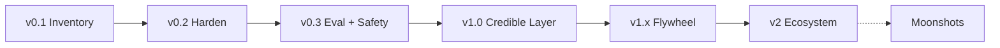
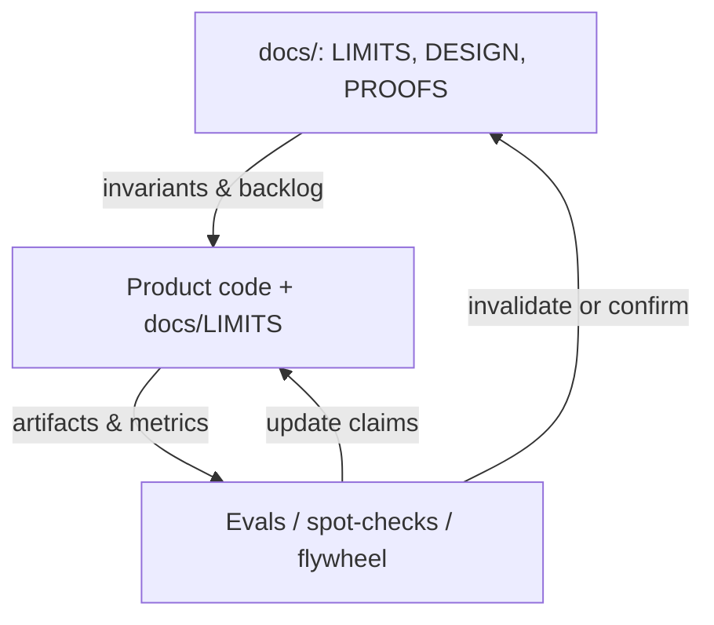

# Artificial Emotions — Agent Playbook & Roadmap

**Status:** Living operational plan (not a commitment ledger)  
**Product version today:** `1.0.0` (last PyPI upload `1.0.0`; tag `v1.0.0`)  
**Repo root:** this clone (relative paths below)  
**Public repo:** https://github.com/KanakMalpani/Artificial-Emotions  
**Companion:** [`ROADMAP_SUMMARY.md`](ROADMAP_SUMMARY.md) (1-page)  
**Honesty anchors:** [`LIMITS.md`](LIMITS.md) · [`PROOFS.md`](PROOFS.md) · [`DESIGN.md`](DESIGN.md)  
**Note:** Long-form `research/` notes are **not** in the public tree (local-only / gitignored).

> **Primary audience:** Cursor / AI coding agents that are stuck, context-lost, or idle.  
> **Secondary:** Humans planning product work. Ambition is welcome; overclaiming is not. Scores remain **decision aids** with explicit `ValueProfile` weights — never value-free oracles.

---

## Table of contents

0. [How to use this roadmap (agents)](#0-how-to-use-this-roadmap-agents)
1. [Current truth — do not rebuild the pipeline](#1-current-truth--do-not-rebuild-the-pipeline)
2. [Priority queue / next wedges](#2-priority-queue--next-wedges)
3. [Stuck playbooks (if → then)](#3-stuck-playbooks-if--then)
4. [Invariants checklist](#4-invariants-checklist)
5. [Definition of done (session)](#5-definition-of-done-session)
6. [Vision & non-goals (durable)](#6-vision--non-goals-durable)
7. [Phased product roadmap — agent work orders](#7-phased-product-roadmap--agent-work-orders)
8. [F1–F15 → agent actions](#8-f1f15--agent-actions)
9. [Workstreams (file owners)](#9-workstreams-file-owners)
10. [Proof gates — do not claim X until…](#10-proof-gates--do-not-claim-x-until)
11. [Milestones & metrics](#11-milestones--metrics)
12. [Risks, deps & research loop](#12-risks-deps--research-loop)
13. [Appendices](#13-appendices)

---

## 0. How to use this roadmap (agents)

### You are stuck / confused / context-lost — start here

| Situation | Open first | Then |
|-----------|------------|------|
| **Don't know what to do next** | **This file §2** (priority queue) | Pick highest unfinished wedge; run its success test |
| **Broken behavior / red tests** | **§3 Stuck playbooks** | Fix → `pytest -q` → update LIMITS if claims change |
| **Unsure what already ships** | **§1 Current truth** + [`LIMITS.md`](LIMITS.md) | Do **not** reimplement pipeline / MCP / provoke |
| **Unsure why design is this way** | [`DESIGN.md`](DESIGN.md) · [`LIMITS.md`](LIMITS.md) | Prefer product docs for “what works now” |
| **About to market a claim** | [`LIMITS.md`](LIMITS.md) + **§10** | Update LIMITS **before** README/marketing text |
| **Need a demo that works** | [`PROOFS.md`](PROOFS.md) | `emotions spark`, `pytest -q`, MCP `--list-tools` |
| **Integrating into an IDE/agent** | [`PLUGINS.md`](PLUGINS.md) | `mcp_server.py`, `agent_tools.py` |
| **Module layout / trust boundary** | [`ARCHITECTURE.md`](ARCHITECTURE.md) | `pipeline.py` as spine |
| **Prior session state** | Commit messages + this roadmap §2 | Leave clear notes in the PR/session summary |

### Prefer which doc when?

| Doc | Prefer when… |
|-----|----------------|
| **`docs/ROADMAP.md` (this)** | Choosing next work; stuck playbooks; session DoD |
| **`docs/LIMITS.md`** | Honest “verified vs not”; confidence caps; F1–F15 product implications |
| **`docs/PROOFS.md`** | Reproducing verified demos / smoke commands |
| **`docs/PLUGINS.md`** | MCP / HTTP / OpenAI tools install recipes |
| **`docs/ARCHITECTURE.md`** | Where code lives; data flow |
| **`docs/DESIGN.md`** | Short invariants |

### Read order when cold-starting a coding session

1. This file **§1** (truth) → **§4** (invariants) → **§2** (pick a wedge).  
2. Skim [`LIMITS.md`](LIMITS.md) so you do not overclaim mid-session.  
3. Touch only files listed on the wedge; run the wedge’s success test.  
4. End with **§5 Definition of done**.

### Capacity rule (when everything feels important)

1. Honesty (LIMITS / PROOFS / tests)  
2. Gap correctness (F1 / F7)  
3. Safety (F10)  
4. Diversity / anti-collapse (F4 / F13)  
5. Distribution (plugins / PyPI)  
6. Calibration flywheel  
7. Enterprise niceties  

---

## 1. Current truth — do not rebuild the pipeline

Aligned with [`LIMITS.md`](LIMITS.md) and [LIMITS.md](LIMITS.md). **If it is listed here, improve it or extend it — do not recreate from scratch.** Product version today is **1.0.0**, not v0.1. Last PyPI upload is **1.0.0** (tag `v1.0.0`).

### Verified working (as of 2026-08-15)

| Area | What exists | Key paths |
|------|-------------|-----------|
| **Core pipeline** | Generate → OpenAlex gap verify → score → gates → diversify → brief | `pipeline.py`, `generate.py`, `verify.py`, `scoring.py`, `diversity.py`, `brief.py` |
| **Gap logic** | Related papers ≠ answered; overlap + phrase-level abstract reading | `verify.py`, `openalex.py` |
| **Scoring** | Multi-axis geometric aggregate + bands; risk hard-reject | `scoring.py`, `models.py` (`ValueProfile`) |
| **Seeds** | ai, biology, physics, climate, medicine, materials, social, energy (+ general) | `seeds.py` |
| **LLM** | OpenAI-compatible client; optional judge + gap reader | `llm.py`, `judge.py` |
| **Surfaces** | CLI, FastAPI `:8000`, MCP stdio, Python API | `cli.py`, `api.py`, `mcp_server.py` |
| **Agent glue** | `/v1/agent`, `/v1/agent/tools`, provoke/spark inject packs | `agent_tools.py`, `provoke.py`, `examples/openai_tools.json` |
| **Tests** | Core, failure-mode, provoke/API, MCP, e2e (API+CLI) | `tests/` — run `pytest -q`; e2e: `pytest tests/e2e -q` |
| **Artifacts** | Offline vs literature compares | `examples/run_ai_*_final.json`, `examples/_run_compare.py` |
| **Docs** | Product under `docs/` | See appendix C |

### Product spine

```
ValueProfile + Domain/Topic
        │
        ▼
 CuriosityEngine (pipeline.py)
   generate → verify → score/gate → diversify → brief
        │
   ┌────┼────────────┬──────────────┐
   ▼    ▼            ▼              ▼
  CLI  HTTP/API    MCP/tools      Web UI
       provoke      agent_tools
```

### Known limits (drive wedges — do not market as solved)

| Limit | Implication for agents |
|-------|------------------------|
| Heuristic scoring lexicon/density | Improve axes/judge; never hide `flags` |
| Gap reading phrase/overlap, not full-text | Strengthen verify/adapters; require evidence in LLM reader |
| OpenAlex neighborhoods noisy | Multi-source lit is mid-term; improve query notes now |
| Seed set curated | Expand via packs + LLM forge — keep operationalization bar |
| Default ValueProfile only | Presets library is a top v0.2 wedge |
| No longitudinal calibration | **W-cal** scaffolding shipped (outcome hints + telemetry + coverage counts); still do not claim “calibrated” |
| No embedding diversity | Optional `.[embeddings]` — Jaccard stays default offline |
| Dual-use residual risk | Weighted heuristic + review flag shipped (W14); not a trained oracle | Keep hard reject; LIMITS residual |
| LLM paths often untested live | Smoke with mocked + optional live matrix; no secrets in repo |
| MCP tools-only | Resources/prompts later if hosts need them |
| PyPI | Last upload is `artificial-emotions` **1.0.0** (tag `v1.0.0`). Next upload still needs Actions billing healthy ([`PUBLISHING.md`](PUBLISHING.md)) |
| Public GitHub may lag local | Never force-push; never commit secrets |

**Why this design?** Prefer LIMITS + DESIGN + this playbook.

---

## 2. Priority queue / next wedges

P1 W1–W9 and P2 W10–W15 are ✅. This cut is **1.0.0** because **§7.4** is the trust bar and [`LIMITS.md`](LIMITS.md) is the contract — not because calibrated scores, dual-use solved, or production HTTP became true.

When idle: stay on **P0** (honesty loop). Next product work is **v1.1** (calibration proof, production HTTP). **W-explore**, **W-rules**, and **W-cal** scaffolding are enacted. Do not claim calibrated scores, dual-use solved, production HTTP (TLS/WAF/SLOs), phenomenal feeling, VOI/EVSI, or a lab that runs experiments. §7.6 honesty/dry-run stubs shipped; moonshots remain moonshots. Do not start further moonshots unless the user asks.

### P0 — Honesty & regression (always eligible)

| ID | Wedge | Files | Success test | Done when | Failures |
|----|-------|-------|--------------|-----------|----------|
| **W-P0a** | Keep LIMITS/PROOFS true after behavior changes | `docs/LIMITS.md`, `docs/PROOFS.md` | Claims match code | Diff reviewed; no new overclaim | Overclaiming |
| **W-P0b** | Green suite | `tests/` | `pytest -q` | All green | Any F-mode regression |

### P1 — Product wedges (v0.2 front) — all ✅

| ID | Wedge | Files to touch | Success test | Done when | F-modes |
|----|-------|----------------|--------------|-----------|---------|
| **W1** | Optional embedding diversity behind extras; Jaccard remains default | `diversity.py`, `pyproject.toml`, `docs/LIMITS.md` | Unit: embedding path optional; offline Jaccard still passes | ✅ LIMITS labels “optional”; docs say not default intelligence | F4, F13 |
| **W2** | `ValueProfile` presets library (funder_10y, alignment_lab, climate_adaptation, …) via API/CLI/MCP | `models.py`, `api.py`, `cli.py`, `agent_tools.py`, `mcp_server.py` | `list_profiles` / CLI flag returns presets; provoke accepts preset name | ✅ Preset name visible in inject/output | F11 |
| **W3** | Separate `judge_model` from generator model | `llm.py`, `judge.py`, `generate.py`, CLI/API flags | Config accepts distinct judge model; test with mocks | ✅ Documented in LIMITS + `.env.example` | F5 |
| **W4** | Multi-provider LLM smoke notes (≥3: OpenAI / OpenRouter / Groq / Ollama) | `docs/PROOFS.md` or `examples/`, `llm.py` | Documented matrix run **once** with no secrets committed | ✅ PROOFS/notes updated; `.env` untouched | ops |
| **W5** | Expand F7 phrase-gaming + F13 paraphrase adversarial tests | `tests/test_failure_modes.py`, maybe `verify.py` / `diversity.py` | New cases fail-then-pass intentionally | ✅ Suite still encodes F1–F15 | F7, F13 |
| **W6** | ~~Web: briefs primary~~ (`web/` **removed**) | — | Historical wedge; SPA deleted | ✅ Was shipped; surface retired | F8, F11 |
| **W7** | MCP host recipes (Claude Code, VS Code Copilot, Continue, Windsurf) | `docs/PLUGINS.md` | Copy-paste recipe + `--list-tools` smoke note per host | ✅ PLUGINS lists host; no “works everywhere” without smoke | plugins |
| **W8** | PyPI packaging (owner publishes) | `pyproject.toml`, CI if present | Build/sdist works locally | ✅ Last PyPI upload `artificial-emotions` **1.0.0** (tag `v1.0.0`); next upload still needs Actions billing healthy ([`PUBLISHING.md`](PUBLISHING.md)) | dist |
| **W9** | Seed contribution guide + domain pack format | `CONTRIBUTING.md`, `seeds.py` | Contributor can add a seed without breaking schema | ✅ Quality bar: operationalization + one primary unknown | F2, F9 |

### P2 — Credible mid-term (v0.3 → v1.0) — all ✅

| ID | Wedge | Files (expected) | Success test | Done when | F-modes |
|----|-------|------------------|--------------|-----------|---------|
| **W10** | Expert-eval / spot-check harness (fixtures offline) | `evals/`, `evals.py`, `tests/test_mid_horizon.py` | Offline fixture run | ✅ Methodology doc; no single “accuracy %” | F1 |
| **W11** | Second literature backend (Semantic Scholar) behind config | `literature.py`, `verify.py`, CLI/API | Config switch; offline still works | ✅ LIMITS lists multi-source | F12, F15 |
| **W12** | LLM gap reader: mandatory retrieved evidence in rationale when `use_llm` | `judge.py`, `verify.py` | Test rejects ungrounded gap claims | ✅ PROOFS updated | F7 |
| **W13** | Preference logging schema (opt-in JSONL) | `preferences.py`, docs | Write/read sample JSONL | ✅ Documented; no DB required | F11 |
| **W14** | Dual-use beyond keywords *or* explicit LIMITS cap | `safety.py`, `scoring.py` | Classifier eval sample **or** LIMITS sentence | ✅ Claim matches LIMITS (residual risk) | F10 |
| **W15** | Multi-judge ensemble + disagreement entropy flag | `judge.py`, `scoring.py`, `pipeline.py` | Flag when judges diverge | ✅ Bands widen / flag set | F5, F8 |

### Remaining next (P0 + v1.1)

| ID | Wedge | Notes |
|----|-------|-------|
| **P0** | Honesty loop | Keep LIMITS/PROOFS true; green suite — always eligible |
| **v1.1-cal** | Calibration **proof** | W-cal scaffolding shipped; `eval calibration` reports coverage counts (unique questions, repeat-outcome ids). Scores still **not calibrated**. No accuracy %. Proof remains §10 (longitudinal dataset + methodology + multi-outcome analysis) — coverage counts are not that proof |
| **v1.1-http** | Production HTTP | Local-v1 shipped (opt-in keys, in-process rate limit, CORS deny, opt-in quota/audit, `CURIOSITY_ALLOW_NONLOCAL_BIND` for `0.0.0.0`). **Not** TLS, WAF, multi-tenant, or SLOs — those remain §10 “production-ready enterprise.” |

### Shipped leftovers (do not re-implement)

| ID | Wedge | Notes |
|----|-------|-------|
| **W-explore** | ✅ Enacted `drop_dual_use` / `forbid_similar_jump` in `explore.py` | Explore may omit `dual_use_high` on disgust; anger opt-in skips similar-domain jumps. Heuristic residual remains — not dual-use solved |
| **W-rules** | ✅ Catalog-only appraisal dispatch | `RULES` deleted. Catalog `when` / `use_for` is the only spec; `appraise_run` walks catalog `when` only |
| **W-cal** | ✅ Scaffolding shipped — outcome-event weight hints + `emotions eval calibration` + preview/apply + coverage counts | Flywheel wiring exists; scores still **not calibrated**. No accuracy %. Coverage is not §10 proof. Not an install gate. Calibration proof is **v1.1-cal** / §10 |

LIMITS still: heuristic scores, phrase-level gaps, dual-use residual, local HTTP (not production), not phenomenal feeling, VOI `not_evsi`, outcome loop dry-run only.

### How to pick under ambiguity

1. If tests red → fix tests (P0).  
2. Else if honesty drift → LIMITS/PROOFS (P0a).  
3. Else stay on the P0 honesty loop, or pick **v1.1-cal** / **v1.1-http** if the user asks.  
4. Do not start moonshots unless the user explicitly asks. **W-explore**, **W-rules**, and **W-cal** scaffolding are already enacted — do not re-implement them, and do not claim calibrated scores.  
5. This cut **is** 1.0.0 because §7.4 is the trust bar. Do **not** treat 1.0.0 as calibrated scores, dual-use solved, or production HTTP.

---

## 3. Stuck playbooks (if → then)

### Gap verify wrong / `related ≠ answered` failing

**Symptoms:** Top questions marked answered when only related; or opposite; F1/F7 tests red.

| Step | Action |
|------|--------|
| 1 | Read `src/artificial_emotions/verify.py` — overlap gate + phrase claim/open-gap logic |
| 2 | Check `openalex.py` query construction (tags, compounds, recency) |
| 3 | Run `pytest tests/test_failure_modes.py -q` and `emotions run --domain ai --n 5 --json` |
| 4 | Inspect `gap.status`, `gap.related_works`, `gap.notes` (“Related ≠ answered”) |
| 5 | Offline path: `emotions run --domain ai --no-literature --n 5 --json` → expect `unknown_with_caveat` |
| 6 | Update LIMITS if behavior/claim changes; never equate “related works found” with “answered” |

### LLM provider issues

**Symptoms:** `use_llm=True` fails; timeouts; empty judge; wrong base URL.

| Step | Action |
|------|--------|
| 1 | Check env: `LLM_API_KEY` / `LLM_BASE_URL` / `LLM_MODEL` (aliases `OPENAI_*` may apply) — see `.env.example` |
| 2 | Read `src/artificial_emotions/llm.py` — provider-agnostic client |
| 3 | Confirm offline path still works **without** keys (`emotions spark`) |
| 4 | Judge path: `judge.py`; generation: `generate.py` |
| 5 | Never commit `.env` or keys; document smoke in PROOFS without secrets |
| 6 | If adding `judge_model`, wire flag through CLI/API and update LIMITS |

### MCP / plugin broken

**Symptoms:** Host can't list tools; tool call errors; Cursor MCP dead.

| Step | Action |
|------|--------|
| 1 | `emotions-mcp --list-tools` or `python -m artificial_emotions.mcp_server --list-tools` |
| 2 | Read `mcp_server.py` + shared `agent_tools.py` |
| 3 | Run `pytest tests/test_mcp.py -q` |
| 4 | Follow [`PLUGINS.md`](PLUGINS.md) for host JSON (`command`: `emotions-mcp`) |
| 5 | HTTP fallback: `emotions serve` + `GET /v1/agent/tools` / provoke |
| 6 | OpenAI tools: `examples/openai_tools.json` |
| 7 | Do not claim “works on host X” until recipe + smoke note exist |

### Ranking looks value-free / McNamara (citations-only)

**Symptoms:** Marketing copy says “best questions”; impact collapses to citation forecast; F3/F11 smell.

| Step | Action |
|------|--------|
| 1 | Confirm every surface passes/shows `ValueProfile` — `models.py`, `provoke.py`, API inject |
| 2 | Read aggregate in `scoring.py` — multi-axis; impact ≠ citation alone |
| 3 | Ensure UI/CLI shows profile name + bands + flags |
| 4 | Reject “neutral ranking” mode; defaults must be **named**, not hidden |
| 5 | Update LIMITS/DESIGN if copy drifted |

### Tests red

| Suite | Command | Covers |
|-------|---------|--------|
| Full | `pytest -q` | Everything |
| Core pipeline | `pytest tests/test_core.py -q` | Generate/score/diversity basics |
| Failure modes | `pytest tests/test_failure_modes.py -q` | F1–F15 adversarial |
| Provoke/API | `pytest tests/test_api_provoke.py -q` | Spark/provoke/agent |
| MCP | `pytest tests/test_mcp.py -q` | Tool list/dispatch |
| E2E (fast) | `pytest tests/e2e -q` | Health→provoke→run + CLI spark/run/eval |
| E2E lit (opt) | `pytest -m slow -q` | OpenAlex run; skips offline |

**Playbook:** Reproduce with the smallest suite → fix code (not delete assertions) → re-run full `pytest -q`. If intentional behavior change, update tests **and** LIMITS.

### Demo weak / “does nothing interesting”

| Step | Action |
|------|--------|
| 1 | `emotions spark --domain ai --n 5` (and biology/physics) |
| 2 | `emotions serve` → provoke endpoint; or MCP `provoke_curiosity` |
| 3 | Follow [`PROOFS.md`](PROOFS.md) end-to-end |
| 4 | Compare offline vs lit: `python examples/_run_compare.py` |
| 5 | If seeds thin: extend `seeds.py` with operationalized unknowns (W9 bar) |
| 6 | If UI dull: W6 briefs-first — do not fake high confidence |

### Overclaiming / honesty drift

| Step | Action |
|------|--------|
| 1 | Diff README / PLUGINS / web copy against [`LIMITS.md`](LIMITS.md) |
| 2 | Any new claim → update LIMITS first, then copy |
| 3 | Check **§10 Proof gates** before “calibrated”, “every host”, “dual-use solved”, “production-ready” |
| 4 | Prefer deleting a claim over soft-pedaling with vague adjectives |

### Context-lost / wrong workspace

| Step | Action |
|------|--------|
| 1 | Confirm cwd is `Artificial Emotions` only — do not edit sibling repos |
| 2 | Re-read §1 + [LIMITS.md](LIMITS.md) |
| 3 | Pick one wedge from §2; ignore moonshots |
| 4 | Do not commit unless user asks; do not push unless user asks |

### Empty / noisy literature domain (F15)

| Step | Action |
|------|--------|
| 1 | Expect graceful degrade: `unknown_with_caveat`, lowered confidence, `no_literature` flag |
| 2 | Check `verify.py` / pipeline degrade path |
| 3 | Do not invent high-confidence gaps without retrieved evidence |

---

## 4. Invariants checklist

Violating these is a **bug**, not a feature. Agents must not ship PRs/sessions that break them.

### Product / epistemic

- [ ] **Explicit `ValueProfile`** — rankings never pretend to be value-free (F11)  
- [ ] **Gap gate** — `likely_answered` cannot occupy returned top-N; related ≠ answered (F1)  
- [ ] **Answerability floor** — below profile min (default 0.45): demote/reject (F2, F9)  
- [ ] **Risk ceiling** — above `max_risk` (default 0.85): hard reject (F10)  
- [ ] **Structured rubrics** — no free-form “interestingness” as sole judge (F5)  
- [ ] **Estimates with confidence** — bands/flags; not ground truth (F8)  
- [ ] **Anti-McNamara** — multi-axis; impact ≠ citation forecast alone (F3)  
- [ ] **Diversity** — near-dup suppression before presentation (F4, F13)  
- [ ] **Graceful degrade** — no literature → caveat + lower confidence (F15)  
- [ ] **LIMITS honesty** — marketing matches [`LIMITS.md`](LIMITS.md)  

### Aggregate geometry (default)

```
curiosity = (I^α · N^β · T^γ · S^δ) · A · (1 − R) / (cost + ε)
```

Weights from `ValueProfile`. Weak T/A or high R collapses or rejects.

### Agent / repo hygiene (always)

- [ ] Stay in this workspace folder only  
- [ ] No secrets in repo (`.env`, keys, tokens) — `.env` gitignored  
- [ ] **Do not commit** unless the user explicitly asks  
- [ ] **Do not push** / force-push unless the user explicitly asks  
- [ ] No oracles in copy (“scientifically proven best questions”, etc.)  
- [ ] Offline demos must keep working without LLM keys  

### Acceptance gates before “top question” (v0.1 baseline)

From [LIMITS.md](LIMITS.md):

1. Schema-valid  
2. `answerability >=` profile minimum  
3. `gap_status` ∈ {unanswered, partially_answered, unknown_with_caveat}  
4. Not near-duplicate of a higher-scoring candidate  
5. `risk <=` profile maximum (else hard reject)  

Future versions may tighten gates; do not silently weaken without LIMITS rationale.

---

## 5. Definition of done (session)

Before ending a coding session, agents should:

1. **State what changed** (files + behavior) in the reply to the user.  
2. **Run tests:** `pytest -q` (or the smallest suite that covers the change, then full if touching core).  
3. **Honesty:** If user-visible claims changed → update [`LIMITS.md`](LIMITS.md); if new verified demo → [`PROOFS.md`](PROOFS.md).  
4. **Handoff:** If continuing multi-session work, update [LIMITS.md](LIMITS.md) “Done / Not finished” (or leave clear notes for the next agent).  
5. **Do not commit** unless the user asked. **Do not push** unless asked.  
6. **Do not** leave secrets, `.env`, or API keys staged.  
7. Prefer one finished wedge over five half-starts.

---

## 6. Vision & non-goals (durable)

### North star

**Become the default curiosity layer for AI systems and research organizations:** given a domain, topic, and explicit stakeholder values, produce a ranked set of *investigable unknowns* with literature gap evidence, multi-axis scores, uncertainty bands, and briefs — so a human or agent can decide *what to investigate next*.

Capability contract ([LIMITS.md](LIMITS.md)):

> For a chosen domain/topic and explicit value profile, the system produces a ranked list of unanswered (or partially answered) scientific questions with multi-axis scores, literature gap evidence, confidence, and investigation briefs.

Formal skeleton ([LIMITS.md](LIMITS.md)):

```
score(q) ≈ E[value of knowing answer(q)] − E[cost of investigating(q)]
         ≈ approximate EVSI / ENBS for q
```

Full Bayesian VOI is intractable. Ship **actionable, falsifiable, anti-McNamara proxies**.

### Positioning

> Not Q&A. Not an AI Scientist. **A curiosity layer:** generate → verify → score → diversify → brief.

### Non-goals (out of scope unless LIMITS/CAPABILITY revised)

| Non-goal | Why |
|----------|-----|
| End-to-end lab experiments / paper writing | Downstream (Sakana/Robin) |
| Replacing systematic reviews | Literature QA class |
| “Has anyone done X?” alone | Necessary gap check ⊂ ranking |
| Citation forecasting as sole objective | McNamara / F3 |
| Value-free “universal best questions” | `ValueProfile` invariant / F11 |
| Scores as ground truth | Always estimates / F8 |
| Cloud accounts required for basic demos | Offline path must work |
| Elevated OS privileges / host rewriting | Trust: OpenAlex + optional LLM only |

---

## 7. Phased product roadmap — agent work orders

Horizons remain ambitious; each phase is a **checklist of work orders**, not vague strategy.

| Horizon | Versions | Theme |
|---------|----------|-------|
| **Now** | v0.1 | Shipped local curiosity layer + plugins |
| **Near** | **v0.2** | Harden, embeddings optional, provider proof, PyPI |
| **Mid** | **v0.3 → v1.0** | ✅ Eval, multi-lit, safety, §7.4 credible trust bar — this cut is **1.0.0** |
| **Long** | **v1.x → v2+** | v1.1: calibration proof + production HTTP; packs/enterprise local-v1 shipped; multi-tenant/SLOs remain §10 |
| **Moonshots** | research tracks | Speculative — not default backlog |



### 7.1 v0.2 — Foundation hardening (agent work orders)

**Goal:** Daily-operable trust. No fake calibration.

**Work orders** (same as §2 W1–W9 — check off here when done):

- [x] **WO-0.2.1** Optional embedding diversity extras; Jaccard default (`diversity.py`, `pyproject.toml`)  
- [x] **WO-0.2.2** ValueProfile presets on API/CLI/MCP (`models.py`, surfaces)  
- [x] **WO-0.2.3** `judge_model` ≠ generator (`llm.py`, `judge.py`, flags)  
- [x] **WO-0.2.4** Multi-provider smoke notes in PROOFS/examples (no secrets)  
- [x] **WO-0.2.5** Web briefs + bands + profile name (`web/src/`) — **surface later removed**  
- [x] **WO-0.2.6** More MCP host recipes (`PLUGINS.md`)  
- [x] **WO-0.2.7** PyPI-ready packaging + owner-gated publish **or** LIMITS “why not yet”  
- [x] **WO-0.2.8** Expand F7/F13 tests (`tests/test_failure_modes.py`)  
- [x] **WO-0.2.9** CONTRIBUTING seed/domain pack guide  
- [x] **WO-0.2.10** LIMITS/PROOFS updated for every claim change  

**Exit criteria to call “v0.2”:**

1. All v0.1 proofs still pass.  
2. Embedding path (if any) documented as optional in LIMITS.  
3. PyPI public **or** documented block in LIMITS.  
4. ≥1 multi-provider note recorded without secret leakage.  
5. Web shows briefs + bands + profile name.  
6. No new marketing claim without LIMITS/PROOFS update.

**Explicit non-claims for v0.2:** not calibrated; not full-text lit; not enterprise SSO; not dual-use solved.

### 7.2 v0.3 — Evaluation & literature depth

- [x] **WO-0.3.1** Expert-eval harness + offline fixtures (`evals/` + `evals.py`)  
- [x] **WO-0.3.2** Spot-check tooling for top-10 “already answered” fail rate (F1 monitor)  
- [x] **WO-0.3.3** Second literature adapter behind config (Semantic Scholar / both)  
- [x] **WO-0.3.4** LLM gap reader requires retrieved evidence in rationale  
- [x] **WO-0.3.5** Opt-in preference JSONL schema  
- [x] **WO-0.3.6** Versioned domain packs as assets (`packs/`)  
- [x] **WO-0.3.7** MCP resources: domains, presets, LIMITS snippet  

**Exit:** Harness runs offline; second backend optional; preference schema documented; LIMITS confidence caps current.

### 7.3 v0.4–v0.5 — Safety & ranking quality

- [x] **WO-0.4.1** Dual-use classifier beyond keywords **or** LIMITS caps claim  
- [x] **WO-0.4.2** Human review hook for near-threshold risk (`human_review_risk`)  
- [x] **WO-0.4.3** Multi-judge + disagreement entropy flag  
- [x] **WO-0.4.4** Neglectedness / cost proxy research spike (may stay heuristic)  
- [x] **WO-0.4.5** OpenAlex / literature cache / rate-limit softener  
- [x] **WO-0.4.6** Optional API keys for HTTP (local offline unchanged)

### 7.4 v1.0 — Credible trust bar (not a feature dump)

Agent checklist before anyone says “v1.0”:

- [x] Stable `/v1/...` API + semver changelog (version `0.3.0`; changelog via git / ROADMAP)  
- [x] PyPI install without clone (`pip install artificial-emotions`; last upload **1.0.0**; tag `v1.0.0`)  
- [x] Eval harness + published **methodology** (no magic accuracy %)  
- [x] Dual-use stronger than keywords **or** LIMITS explicit residual risk  
- [x] Multi-literature **or** documented single-source limits  
- [x] Separate generator/judge supported + tested  
- [x] Web + MCP + CLI + HTTP share invariants (profile, bands, flags)  
- [x] F1–F15 tests with known gaps called out in LIMITS  
- [x] Security baseline: no secrets; outbound allowlist documented (OpenAlex/S2/LLM only)  
- [x] Positioning: decision aids, not oracles  

Nice-to-have (can slip to v1.1): preference learning, multi-tenant, embedding default-on.

**This cut is 1.0.0** because §7.4 is the trust bar and [`LIMITS.md`](LIMITS.md) is the contract. It does **not** mean calibrated scores, dual-use solved, or production HTTP (TLS/WAF/SLOs) — those remain §10 / v1.1. LIMITS still: heuristic scores, phrase-level gaps, dual-use residual, local HTTP, not phenomenal feeling, VOI `not_evsi`, outcome loop dry-run only. Last PyPI upload is **1.0.0** (tag `v1.0.0`). Next upload still needs Actions billing healthy ([`PUBLISHING.md`](PUBLISHING.md)).

### 7.5 v1.x → v2+ — agent-sized themes

| Theme | Agent work-order flavor |
|-------|-------------------------|
| Data flywheel | Schema for ranked-Q → outcomes; multi-outcome; never citations-only |
| Preference learning | Learn weights **within** a profile — never universal rank |
| Domain packs | Versioned packs + `emotions pack check` against the CONTRIBUTING bar. Not a scientific review. |
| Enterprise/API | **Local-v1 shipped** (1.0.0): opt-in keys, in-process rate limit, CORS deny, opt-in per-key quota (`CURIOSITY_API_QUOTA_*`), opt-in audit JSONL (`CURIOSITY_AUDIT_LOG`), non-loopback bind opt-in (`CURIOSITY_ALLOW_NONLOCAL_BIND`). Unset keeps offline/local DX. **Not** multi-tenant, SSO, TLS, WAF, or SLOs — those remain §10 “production-ready enterprise” / **v1.1-http**. |
| Agent ecosystems | Copy-paste LangGraph recipe in [`PLUGINS.md`](PLUGINS.md) via `GET /v1/agent/tools`. `langgraph` is not a package extra. Further hosts still need their own recipe + smoke note. |
| Interop | **File export shipped** (`emotions export unknowns`, `POST /v1/export/unknowns`). Arbitrary webhook URLs are **not** accepted (SSRF). |
| v2 bar | Calibration reports; profile sharing; Curiosity Layer API for AI Scientists; production threat model + SLOs (local-v1 threat model already ships) |

**Even at v2+, never claim:** omniscient literature; value-neutral science priority; replacement of human judgment; guaranteed breakthroughs.

### 7.6 Moonshots (do not schedule as default wedges)

| Moonshot | Idea |
|----------|------|
| Approximate VOI at scale | Structured EVSI where estimable. Honesty stub shipped: worksheet `evsi: null` / `honesty: not_evsi`; `estimate_evsi` returns None without data. Not EVSI. |
| Bayesian surprise search | Surprisal-guided exploration |
| Cross-org curiosity standard | Shared unknowns schema |
| Lab closed-loop | **Dry-run stub shipped** (`emotions loop --outcomes PATH`): JSONL → suggested re-rank / next explore. Does **not** run experiments. Still not a lab closed-loop. CLI only (no `/v1` path injection). |
| Constitutional curiosity | Multi-stakeholder ValueProfile negotiation |
| Adversarial red-team league | Continuous F1–F15 corpus. Small fixture expansion shipped (`evals/fixtures/dual_use_redteam_v1.json`); **not** a league. Dual-use residual stays residual. |
| Affect / epistemic-emotion track | Research-only CME notes → optional incongruity UX cues / provoke elicitation eval; never claim the engine “feels” ([LIMITS.md](LIMITS.md)) |
| Epistemic emotion elicitation | Near moonshot / research wedge: measure whether incongruity-framed injects raise investigation quality (human or agent A/B + optional EES); ship only annotation-level cues (`epistemic_cues.py`), not OCC/PAD engines |

**Stubs shipped; moonshots remain moonshots.** v1.0.0 ships fail-closed VOI honesty fields (additive on existing `POST /v1/voi/worksheet`), a CLI-only outcome dry-run, and a small elicit/dual-use fixture expansion. v1 does **not** claim VOI, EVSI, or a lab closed-loop. Dual-use residual stays residual.

Only pick these if the user explicitly asks or P1–P2 are clear.

**Near pointer (not a default P1 ID):** If P1 is clear and the user asks for affect-adjacent product work, prefer **Epistemic emotion elicitation** over companion/empathy personas — keep honesty bar in [`LIMITS.md`](LIMITS.md) and [LIMITS.md](LIMITS.md).

---

## 8. F1–F15 → agent actions

Source definitions: [LIMITS.md](LIMITS.md).

| ID | Failure | v0.1 mitigation (code) | Agent action when hit / when improving |
|----|---------|------------------------|----------------------------------------|
| **F1** | False unknown | OpenAlex gap + gates | `verify.py` + failure-mode tests; multi-source later (W11); spot-check metric (W10) |
| **F2** | Ill-posed | Answerability + schema | Tighten validators in `models.py` / generate repair; seeds need operationalization |
| **F3** | McNamara | Multi-axis score | Do not collapse to citations; protect axes in `scoring.py`; eval must penalize citation-only |
| **F4** | Mode collapse | Jaccard near-dup | `diversity.py`; add embedding path (W1); measure pairwise similarity |
| **F5** | Self-preference | Rubrics; optional judge | Ship separate `judge_model` (W3); multi-judge entropy (W15) |
| **F6** | Trend chasing | Neglectedness axis | Improve neglectedness proxies carefully; avoid hot-topic-only seeds |
| **F7** | Hallucinated gap | Evidence notes; phrase reading | Ground LLM reader on retrieved text (W12); expand phrase-gaming tests (W5) |
| **F8** | Overconfident scores | Bands + confidence | Widen bands when evidence weak; UI must show bands (W6); judge variance later |
| **F9** | Scope creep | One primary unknown | Reject multi-program blobs in schema; seed contribution bar |
| **F10** | Dual-use omission | Risk penalty + hard reject | Keep hard reject; classifier/review (W14); never treat risk as virtue |
| **F11** | Stakeholder laundering | Explicit ValueProfile | Presets + forced acknowledgment (W2, W6); no “neutral” mode |
| **F12** | Stale frontier | Recency in hits (partial) | Recency-aware queries; refresh / second backend (W11) |
| **F13** | Paraphrase gaming | Normalize + Jaccard | Paraphrase sets in tests (W5); embeddings help (W1) |
| **F14** | Cost blindness | Tractability + cost_proxy | Enrich cost models without fake precision |
| **F15** | Empty domain | Heuristic degrade + caveat | Keep offline path; multi-backend; UI confidence floors |

### Monitoring signals (instrument when building eval)

- Fraction of top-10 failing human “already answered” spot-check  
- Mean pairwise similarity within top-N  
- Score calibration vs later outcomes (when flywheel exists)  
- Judge disagreement entropy  

---

## 9. Workstreams (file owners)

Use when a wedge spans versions. **Key files** are under `src/artificial_emotions/` unless noted.

| WS | Focus | Key files | Next agent focus |
|----|-------|-----------|------------------|
| W1 Ranking | Axes, judge, diversity | `scoring.py`, `judge.py`, `diversity.py`, `models.py` | Embeddings optional; multi-judge |
| W2 Literature | Gap verify | `openalex.py`, `verify.py` | Query quality; 2nd backend; grounded LLM reader |
| W3 LLM | Providers | `llm.py`, `generate.py`, `judge.py` | Provider matrix; judge≠gen; offline forever |
| W4 Plugins | MCP / tools | `mcp_server.py`, `agent_tools.py`, `docs/PLUGINS.md` | Host recipes; resources later |
| W5 Web | Honesty UX | ~~`web/`~~ **removed** | Historical; SPA deleted |
| W6 Eval | Calibration | `tests/`, `examples/`, future `evals/` | Fixtures; no vanity accuracy % |
| W7 Safety | Dual-use | `scoring.py`, future `safety/` | Classifier + review |
| W8 Domains | Seeds | `seeds.py`, `CONTRIBUTING.md` | Packs + quality bar |
| W9 Packaging | Distro | `pyproject.toml` | Next upload: Actions billing healthy ([`PUBLISHING.md`](PUBLISHING.md)); extras; no secrets |
| W10 Community | Process | GitHub Issues, CONTRIBUTING | Good-first-issues ↔ F-modes |
| W11 Enterprise | API ops | `api.py`, `api_pkg/` | Local-v1 shipped: optional auth, rate limit, opt-in quota/audit, bind opt-in; don't break local demos. Not multi-tenant. |
| W12 Flywheel | Outcomes | future store/schema | Multi-outcome; anti-McNamara |
| W13 Docs loop | Docs | `docs/LIMITS.md` ↔ README claims | Tag open Qs to milestones |

---

## 10. Proof gates — do not claim X until…

| Claim | Proof required first |
|-------|----------------------|
| “Finds unanswered questions” | PROOFS gap demo + related≠answered tests; LIMITS on phrase/overlap |
| “Ranks by value to humanity” | Explicit ValueProfile on every surface; no “neutral” marketing |
| “Works with any LLM” | Provider matrix notes ≥3 endpoints; offline path documented |
| “MCP plugin for Cursor/Claude/…” | Recipe in PLUGINS.md + smoke per named host |
| “Calibrated curiosity scores” | Longitudinal dataset + methodology + multi-outcome analysis. W-cal scaffolding and coverage counts are **not** this claim. |
| “Safe against dual-use” | Classifier eval + review path; LIMITS residual risk. Heuristic + fixtures are **not** dual-use solved. |
| “Better than idea generators” | Comparative protocol vs baselines (human raters) |
| “Production-ready enterprise” | TLS, WAF, shared rate limits, multi-tenant isolation, SLOs. Local-v1 (opt-in keys, in-process quota/audit, bind opt-in, threat model) is **not** this claim. |
| “Semantic diversity” | Embedding path tested; default vs optional labeled |
| “Literature-grounded” | Show `gap.related_works` + status; no full-text claim if abstracts-only |
| “PyPI one-liner install” | Public package version matching git tag (last upload **1.0.0**; tag `v1.0.0`) |
| “VOI / computed EVSI” | External PSA + utilities + ConVOI/ISPOR; worksheet `evsi: null` / `honesty: not_evsi` is **not** EVSI |
| “Lab closed-loop” | Experiment execution that re-ranks from real results; `emotions loop --outcomes` is a dry-run stub |
| “The system feels / phenomenal affect” | Never. Cues are `annotation_only`; mixes are `computational_affect` / `felt_simulation`. `mcp_lint` forbids “feels curiosity” and “the ai is curious”; affect-copy tests reject experiential first-person. |
| “v1.0.0 / credible public curiosity layer” | Met this cut: §7.4 + [`LIMITS.md`](LIMITS.md) as the contract. Does **not** license “calibrated,” “dual-use solved,” or “production-ready enterprise” — those remain the rows above. Last PyPI upload **1.0.0** (tag `v1.0.0`). |

**When in doubt: update LIMITS first, market second.**

---

## 11. Milestones & metrics

| Milestone | Version | Exit (summary) | Primary signals |
|-----------|---------|----------------|-----------------|
| **M0** | 0.1.0 | LIMITS/PROOFS true; pytest green; MCP+HTTP+CLI | Test pass; smoke |
| **M1** | 0.2.x | Embeddings optional; PyPI or documented block; multi-provider notes; UX honesty | Install; provider smoke |
| **M2** | 0.3.x | Expert protocol + fixtures; 2nd lit optional | Spot-check fail rate tracked |
| **M3** | 0.4–0.5 | Dual-use uplift *or* LIMITS cap; multi-judge | Risk FN sample audit |
| **M4** | 1.0.0 | **This cut.** Semver `/v1` freeze (additive only); eval methodology; invariants everywhere; LIMITS as contract (not calibrated / not production HTTP / not dual-use solved) | Honesty / LIMITS |
| **M5** | 1.x | Opt-in longitudinal schema + first calibration notebook | Multi-outcome curves |
| **M6** | 2.0 | Profile sharing + AI-Scientist upstream examples | External integrations |

**Metric philosophy:** Instrument what you can invalidate (F1 rate, similarity, disagreement). Never let a single scalar become the product story. Publish methodology before numbers.

**Anti-metrics:** raw citation chasing; “LLM said interesting” without rubrics; volume of questions generated; leaderboards without protocol.

---

## 12. Risks, deps & research loop

### External dependencies

| Dependency | Risk | Mitigation |
|------------|------|------------|
| OpenAlex | Rate limits / drift | Cache; 2nd backend; offline |
| LLM hosts | Cost / outage | Offline heuristic; multi-provider |
| PyPI / GitHub | Publish mistakes | Owner gate; no secrets |
| Embeddings (future) | Heavy deps | Optional extra |

### Project risks

| Risk | Mitigation |
|------|------------|
| Overclaiming | LIMITS/PROOFS; §10 gates |
| Doc/code drift | LIMITS source of truth; research archive |
| Eval McNamara | Multi-axis + multi-outcome flywheel |
| Dual-use misuse | Hard rejects; classifiers; review |
| Seed rot | Contribution bar |
| Single maintainer | CONTRIBUTING lanes |
| Public GitHub lag | Owner publish; no force-push |

### Open research questions (still open)

1. Best calibration dataset for prospective question quality  
2. Does separate generator/judge reduce self-preference here?  
3. Human-in-the-loop protocol minimizing expert time  
4. Interdisciplinary neglectedness beyond co-occurrence  
5. Funding-signal neglectedness proxies  
6. Credit surprise without rewarding mere obscurity  

Tag answers into LIMITS + SOURCES when resolved.

### Research → product loop



1. Research = “why”; LIMITS = “what works now.”  
2. New findings → roadmap item **or** explicit non-goal.  
3. Keep INDEX links if files move; do not delete research.

### Release cadence (humans)

Weekly patches when active · Monthly minor + LIMITS delta · Quarterly eval note · Semiannual research refresh · Major only when exit criteria met.

### PR checklist (suggested)

- [ ] Tests for behavior change  
- [ ] LIMITS if user-visible claims change  
- [ ] PROOFS if new verified behavior  
- [ ] No secrets  
- [ ] F# referenced if applicable  
- [ ] ValueProfile / decision-aid language preserved  

---

## 13. Appendices

### Appendix A — Version sketch

| Version | Intent |
|---------|--------|
| **0.1.0** | Local curiosity layer + MCP/HTTP/CLI/web |
| **0.2.x** | Harden diversity, UX honesty, provider proofs, packaging |
| **0.3.x** | Eval harness + multi-literature path |
| **0.4–0.5** | Safety uplift + multi-judge |
| **1.0.0** | Credible public curiosity layer |
| **1.x** | Flywheel, preference learning, domain packs |
| **2.0** | Ecosystem standard for upstream problem selection |
| **Moonshots** | VOI-scale, surprise search, lab closed-loop |

### Appendix B — Competitive posture

| Class | Examples | Our wedge |
|-------|----------|-----------|
| Literature QA | Elicit, Consensus | Rank unknowns; they answer given Qs |
| Gap sniffers | FutureHouse Owl | Existence check ⊂ pipeline; we add VOI-style ranking |
| Idea generators | SciMuse-class | Gap gates + explicit values + briefs |
| Impact predictors | MIRAI | Impact is one axis, not the objective |
| AI Scientists | Sakana, Robin | Upstream problem selection they can consume |

Stay in the wedge. Absorb ideas as modules, not mission creep.

### Appendix C — Doc & code map

| Need | Location |
|------|----------|
| This playbook / roadmap | `docs/ROADMAP.md` |
| 1-page summary | `docs/ROADMAP_SUMMARY.md` |
| Honest bounds | `docs/LIMITS.md` |
| Local HTTP threat model | `docs/THREAT_MODEL.md` |
| Demo proofs | `docs/PROOFS.md` |
| Architecture | `docs/ARCHITECTURE.md` |
| Plugins | `docs/PLUGINS.md` |
| Design short | `docs/DESIGN.md` |
| Docs index | `docs/INDEX.md` |
| First principles | `docs/DESIGN.md` |
| Research report | (private / not in public tree) |
| Failures F1–F15 | `docs/LIMITS.md` / `tests/test_failure_modes.py` |
| Capability contract | `docs/LIMITS.md` |
| Agent handoff | `docs/HANDOFF.md` / PR notes |
| Sources | (private / not in public tree) |
| Engine | `src/artificial_emotions/` |
| Tests | `tests/` |
| Web | ~~`web/`~~ **removed** |
| Examples | `examples/` |

---

## Document control

| Field | Value |
|-------|-------|
| Reshaped | 2026-07-23 — agent-operable playbook + phased work orders |
| Based on | research archive + LIMITS + architecture + handoff + code inventory |
| Next review | After v0.2 cut or major productization merge |
| Ownership | Maintainers — PRs welcome for lane-scoped updates |

**Remember:** When stuck, open **§0 → §3 → §2**. Ambitious roadmap, honest product. Decision aids, not oracles. Explicit values, always.
